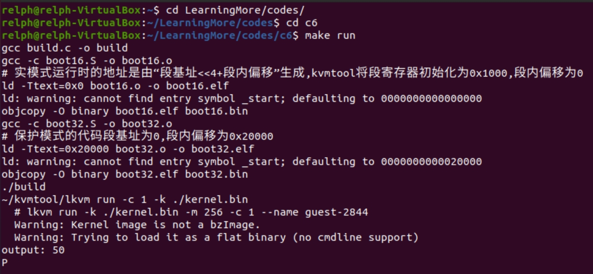

# 第6章 32位引导过程

## 1 实模式与保护模式

- 实模式：直接使用真实得物理地址访问内存的模式。
  - 寻址方式（20位物理地址）：段基址 << 4 + 段内偏移
- 保护模式：
  - 特权级：分为4个特权级，特权级0有权操作关键资源，操作系统内核一般运行在特权级0，应用程序一般运行在特权级3。
  - 段寄存器装载的是段描述符数组的索引。
  - 地址组成：从段寄存器中取出段的索引，根据索引从段描述符表中读取对应的段描述符，从段描述符中取出段基址，再拼接段内偏移。
- 平坦模式：将段基址设置为0，段长设置为线性地址空间的整个长度。

## 2 内核映像组成及布局

- 实模式地址空间：CPU可以寻址1MB地址空间
  - 高521KB：系统BIOS、显卡BIOS以及显存。
  - 低32KB：主要与DOS相关。
- 内核映像（image）布局：
  - 使用`kvmtool`创建虚拟计算机运行内核。
  - 初始化：`kvmtool`将各段寄存器初始化为`0x1000`，将指令指针初始化为0。
  - 布局：内核实模式必须部署在`0x10000`（64KB）处，保护模式部署在`0x20000`（128KB）处，将64位模式部署在1MB处。

## 3 创建保护模式的段描述符

- 段描述符格式：每个段描述符长度为64位
  - 段基址：段的基地址
  - 段长度：当粒度为0时，表示段的长度以字节为单位，为1时，表示以4KB为单位。64位禁止段模式，处理器模式段长为整个地址空间。
  - D/B：当为代码段（D），用于标识默认操作数的宽度，1表示32位，0表示16位；当为栈段和数据段（B），对于栈段，0表示使用寄存器SP作为栈指针，1表示使用寄存器ESP作为栈指针，对于数据段，0表示段上限为64KB，1表示段上限为4GB。
  - 长模式：仅适用于64位模式的代码段，为1时，段用于64位模式，为0时，段用于兼容模式。
  - 存在位：用于标识段是否存在于内存中，为1时，表示段在内存中，为0时，表示段被换出内存。
  - 特权级：段的权限，0表示最高优先级，3表示最低优先级，内核运行在最高特权级0，应用程序运行于特权级3。
  - 描述符类型：1表示代码/数据段，0表示系统段。
  - 段类型：在不同段的含义不同：
    - 代码段：第11位（1）、第10位（是不是一致性代码段，是否允许运行在不同特权级的处理器访问）、第9位（是否可读）、第8位（是否访问过）
    - 数据段：第11位（0）、第10位（扩展方向）、第9位（是否可写）、第8位（是否访问过）

## 4 保护模式的内核代码段描述

- 使用模式：使用平坦模式。
- 值：00c0 9a00 0000 07ff
- 说明
  - 段基址：0
  - 段粒度：1，表示以4KB为单位
  - 段长度：内核代码段可设置为8MB，以4KB作为段粒度，8MB / 4KB = 2048，十六位表示`0x7ff`。
  - D/B：1，表示32位代码段
  - 长模式：0，由于是内核段，使用兼容模式
  - 存在位：初始化为1
  - 特权级：运行在内核，设置为00
  - 描述符类型：1，表示代码段
  - 段类型：第11位（1）、第10位（0、不允许不同特权级的处理器访问）、第9位（1，内核代码段可读）、第8位（0，由处理器负责）

## 5 从实模式到保护模式

### 5.1 加载段描述符表地址

- 使用寄存器GDTR记录段描述符表的地址，长度为48位。
- 使用专用指令`lgdt`从内存中加载段描述符表地址到寄存器GDTR。

```nasm
.text
.code16
start16:
    # 清除标志寄存器中的中断位
    cli

    # 加载段描述符表地址到寄存器GDTR
    lgdt gdtr
gdt:
    # 段描述符表的第0项保留不用
    .quad 0x0000000000000000
    # 第1项定义内核代码段
    .quad 0x00c09a00000007ff
    # 第2项定义内核数据段
    .quad 0x00c09200000007ff
gdt_end:

gdtr:
    # 低16位对应段描述符表的长度
    .word gdt_end - gdt
    # 高16位对应段描述符表的地址（0x1000<<4 + gdt）
    .word gdt, 0x1
```

### 5.2 开启处理器保护模式

- 控制寄存器CR0的第0位PE（Protection Enable）用于控制处理器是否开启保护模式。
- 寄存器CR0是32位的，使用寄存器EAX作为临时存储。

```nasm
# 开启处理器的保护模式，CR0寄存器的第0位PE用于控制处理器是否开启保护模式
mov %cr0, %eax
# 将CR0的最后一位置为1，即开启保护模式
or $0x1, %eax
mov %eax, %cr0
```

### 5.3 跳转到内核保护模式

跳转步骤：
1. 更新代码段寄存器CS，当切换到保护模式后，CS存储的是内核代码段在段描述符中的索引。
2. 指令指针指向保护模式入口处的指令。

- 段选择子：包括段索引（3~15）、TI（2）、特权级（1~0）
  - 段索引：段在段描述符表中的索引
  - TI：用于标识全局/局部段描述符表中的段
  - 特权级：00表示特权级0，11表示特权级3。

具体原理：
- 设置内核代码段选择子：0x8，将内核代码定义在全局描述符表中的第1项位。
- 跳转：从实模式跳转到保护模式，使用长跳转指令`ljmpl`。

```nasm
# 段选择子是0x8（段索引是1，使用全局段描述符表TI是0，特权级是00，即0000000000001000）
# 保护模式的入口地址是0x20000，段基址为0，所以段内偏移地址为0x20000
# 长跳转指令ljmpl [段选择子] [段内偏移地址]
ljmpl $0x8, $0x20000
```

### 5.4 编译及创建内核映像文件

- 原理：`kvmtool`创建虚拟机后，会从一个文件加载内核映像到虚拟机内存中，需要将实模式和保护模式合并到一个文件中。
- 方案：
  - 编译：使用gcc方式编译汇编文件。
  - 文件组装：使用C语言编写程序完成文件的组装过程，代码见`codes/implement-an-os-from-scratch/c6/build.c`
- 整体构建内核：
  - 编译`kernel.bin`。
  - 单独编译`boot16.bin`、`boot32.bin`。
  - 调用`build.c`程序，将多个文件组装成一个`kernel.bin`文件。
  - 使用`kvmtool/lkvm`运行内核。

## 6 运行结果

运行`make run`命令，打印字符`P`。

