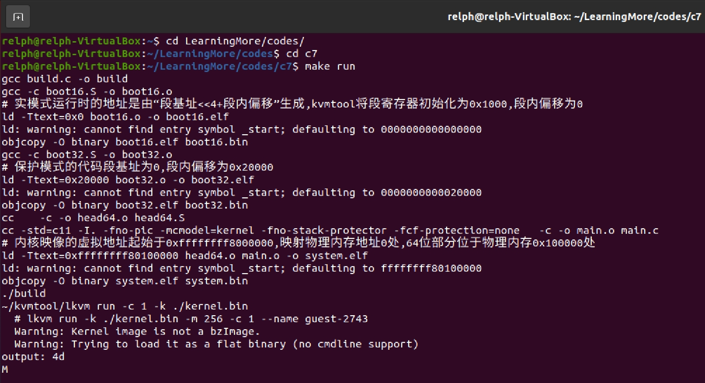

# 第7章 64位引导过程

## 1 内存分页

- 分页的原因：程序运行时以页为单位按需加载，一旦出现内存紧张时，只需将必要的页面交换出去，通常选择最近最少使用的页面进行交换。
- 分页模式下的地址翻译过程：
  1. 从GDTR中取出段描述符表地址。
  2. 根据段寄存器中的索引，从段描述符表中得到段描述符，取出段基址。
  3. 将段基址+偏移地址，得到一个内存地址（虚拟地址）。
  4. 经过线性地址映射，得到真实的物理地址。
- 程序的虚拟地址空间：在分页模式下，程序通过自己的页表映射到具体的物理地址。
- 分页模式下的寻址：先找到虚拟地址所在的页，从页表中寻找页面基址，加上页内偏移，得到最终的物理地址。

## 2 页表

四级页表的虚拟地址翻译成物理地址的步骤：
1. 内存管理单元MMU从寄存器CR3中取出4级页表的基址。
2. MMU提取虚拟地址的第39\~47位，索引4级页表中的页表项，从中取出3级页表的基址。
3. MMU提取虚拟地址的第30\~38位，索引3级页表中的页表项，从中取出2级页表的基址。
4. MMU提取虚拟地址的第21\~29位，索引2级页表中的页表项，从中取出1级页表的基址。
5. MMU提取虚拟地址的第12\~20位，索引1级页表中的页表项，从中取出物理页帧的基址。
6. MMU提取虚拟地址的第0\~11位，作为物理页帧的页内偏移，将其与页帧的基址相加，计算出具体的物理内存地址。

## 3 64位模式下程序的虚拟地址空间

- Linux系统地址空间分配：内核空间分配在高地址部分，用户空间分配在低地址部分，系统运行时，通过页表将虚拟地址映射到物理内存中应用程序或者内核对应的指令。
- 采用`canonical`形式，将整个地址空间分为上下两个部分，使用64位中的低48位寻址。
  - 下半部分：从0\~`0x00007fffffffffff`
  - 上半部分：从`0xffff800000000000`\~`ffffffffffffffff`

## 4 64位模式的内存创建

### 4.1 64位临时段描述符表

- 内核代码段的值：`0020 9a00`
- 说明：
  - 长模式（21）：设置为1。
  - 存在位（15）：标识段是否存在于内存中。
  - 特权级（13\~14）：设置为3，用户程序运行在特权级3。
  - 描述符类型（12）：设置为1，表示代码段
  - 段类型：第11位（1）、第10位（0，一致性），第9位（1，可读），第8位（0，由CPU自动设置）
- 用户代码段的值：`0020 fa00`
- 内核数据段的值：`0000 9200`
- 用户数据段的值：`0000 f200`

### 4.2 建立内核映像的虚拟地址到物理地址的映射

- 目的：为内核代码和数据映射64MB的物理内存区域。
- 方案：从内存地址`0x30000`，分配32个一级页表，以及四级、三级、二级页表各1个。使用页表项中的第0\~47位记录下一级页表的地址，使用页表项的低12位设置页表权限控制等属性。
- 实现步骤：
  1. 建立四级页表映射：设置四级页表的第512项指向三级页表，三级页表地址是`0x31000`，访问位（5）是0，由MMU负责设置；权限控制位（2）是0，表示是否允许访问该页表项映射的物理地址，0表示只允许内核访问，1表示用户可访问；读写位（1）是1，表示通过这个页表项寻址的物理页是否允许读写；存在位（0）是1，表示这个页表项是空还是指向一个已分配好的下级页表。
  2. 建立三级页表映射：设置三级页表的第510项指向二级页表，二级页表地址是`0x32000`，页面尺寸（7）是0，表示x86支持的物理页面尺寸，1表示1GB，0表示其他尺寸。
  3. 建立二级页表映射：从`0x33000`处依次分配32个一级页表，设置二级页表的第0\~31项指向32个一级页表，使用循环配置页表映射。
  4. 建立一级页表映射：从`0x0`开始分配16384个一级页表项，使用循环配置页表映射。
  5. 建立恒等映射：为支撑从保护模式到64位模式的平滑过渡，将虚拟地址翻译为相等的物理地址，覆盖内核过渡部分的代码和数据，填充四级、三级和二级页表的第0项。

### 4.3 切入64位模式

从保护模式切入64位模式的步骤：
1. 设置控制寄存器CR4的PAE位，使能x86的物理地址扩展功能。
2. 设置控制寄存器CR3指向页表。
3. 设置扩展功能使能寄存器EFER的LME位为1，使能64位模式。
4. 设置控制寄存器CR0的PG位，开启分页功能。
5. 通过长跳转指令，跳转到64位部分。

## 5 进入内核64位部分

### 5.1 创建64位模式段描述符表

段描述符表组成如下：
- 空描述符（保留不用）
- 内核代码段描述符
- 内核数据段描述符
- 32位用户代码段描述符
- 用户数据段描述符
- 64位用户代码段描述符

段选择子的定义如下（代码见：`codes/implement-an-os-from-scratch/c7/include/segment.h`）：

```c
// 内核代码段选择子
#define KERNEL_CS 0x8
// 内核数据段选择子
#define KERNEL_DS 0x10
// 32位用户代码段选择子
#define USER32_CS 0x1b
// 用户数据段选择子
#define USER_DS 0x23
// 64位用户代码段选择子
#define USER_CS 0x2b
```

### 5.2 跳转到内核地址空间

使用参数入栈的方式，分配一个4KB的栈空间，结合push和ret指令实现绝对跳转：

```nasm
# 使用RSP寄存器指向栈底
mov $task0_stack, %rsp
# 跳转到main方法
push $main
ret
```

### 5.3 构建内核64位部分

使用CFLAGS，控制编译时传递给编译器的参数，代码见：`codes/implement-an-os-from-scratch/c7/makefile`

```makefile
CFLAGS = -std=c11 -I. -fno-pic -mcmodel=kernel -fno-stack-protector -fcf-protection=none
```

说明：
- `-I`：告诉预处理器处理`#include`指令时，从哪些目录搜索头文件，顺序为首先从文件所在的目录开始寻找，然后再到选项`-I`指定的目录寻找，最后到系统目录如`/usr/include`下寻找。
- `-fon-pic`：表示位置无关代码，可以加载在程序地址空间中的任何位置，用于多个程序使用的共享库。
- `-mcmodel=kernel`：用于指示gcc生成使用64位寻址操作数的汇编代码，基于large模型改进，减少指令长度。
- `-fno-stack-protector`：用于关闭栈溢出检查。
- `-fcf-protection=none`：关闭gcc检查代码的特性

## 6 运行结果

运行`make run`命令，打印字符`M`。

