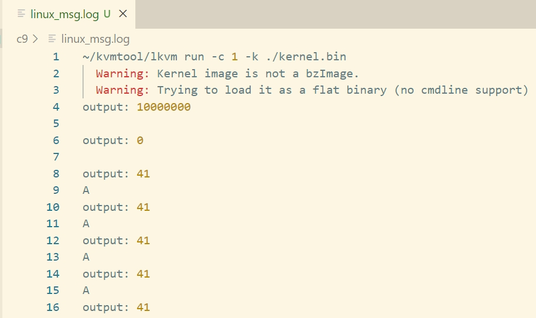

# 第9章 进程

## 1 程序运行环境

- 用户态：运行在用户空间的程序。
- 内核态：运行在内核空间的程序。
- 内核栈：每个程序中，用于存储函数的局部变量的栈，也可以保存程序用户态的上下文。在执行内核代码前，内核需要将寄存器的值保存到栈中，返回用户程序前，内核再从栈中恢复寄存器的值，恢复处理器的用户态。
- 任务状态段（TSS）：每个任务可以创建一个任务状态段的系统段，其中保存了任务的内核栈地址。
- 任务寄存器（TR）：任务寄存器记录了任务状态段的段选择子，每次切入内核时，处理器通过任务寄存器找到任务状态段，从任务状态段中获取任务的内核栈地址。

## 2 创建应用程序app1

- 应用程序app1的主要功能：循环向串口输出字符`A`。
- 加载地址：将应用程序app1加载到内核映像文件中偏移`0xc800000`\~`0x10000`处。

## 3 任务结构体

- 作用：用于记录进程的信息和状态。

```c
// 记录进程的信息和状态
struct task {
    unsigned long id; 
    unsigned long rip;     // 任务调度切换时，指令的地址
    unsigned long rsp0;    // 任务调度切换时，内核栈的栈顶
    unsigned long kstack;  // 内核栈的栈底，用于在内核时，任务状态段中特权级为0的栈指针指向当前任务的内核栈栈底
    unsigned long pml4;    // 根页表的物理地址，用于更新寄存器CR3指向当前任务的页表

    // 支撑任务链的链表
    struct task* next;     
    struct task* prev;
};
```

## 4 建立进程地址映射

- 进程页表映射：在进程的虚拟地址空间中，内核空间的起始地址为`0xffff800000000000`，其低48位`0x800000000000`用于寻址。四级页表中高256项用于映射内核空间，低256项用于映射用户空间。
- 内核空间映射：在新创建的进程的四级页表中，映射内核空间的页表项直接复制0号任务的四级页表项。
- 用户空间映射：使用内存管理的`map_range`函数建立映射，传入第4个参数`0x4`，设置页表项中的`U/S`位为1，表示允许用户进程访问映射的内存。

## 5 创建进程任务状态段及内核栈

1. 定义任务状态段的格式

```c
// 可以寻址64K（65536）个端口
#define IO_BITMAP_BYTES (65536 / 8)

struct tss {
    uint32_t reserved1;                       // 保留
    uint64_t rsp0;                            // 特权级为0的栈指针
    uint64_t rsp1;                            // 特权级为1的栈指针
    uint64_t rsp2;                            // 特权级为2的栈指针
    uint64_t reserved2;                       // 保留
    uint64_t ist[7];                          // IST的7个专用栈
    uint32_t reserved3;                       // 保留
    uint32_t reserved4;                       // 保留
    uint16_t reserved5;                       // 保留
    uint16_t io_bitmap_offset;                // 程序I/O权限位图相对于任务状态段基址的16位偏移
    uint8_t io_bitmap[IO_BITMAP_BYTES + 1];   // I/O权限位图
} __attribute__((packed));
```

2. 定义任务状态段的段描述符

```c
struct tss_desc {
    uint16_t limit0;    // 段长度
    uint16_t base0;     // 段基址（0~15）
    uint16_t base1 : 8, type : 4, desc_type : 1, dpl : 2, p : 1;
    uint16_t limit1 : 4, avl : 1, zero0 : 2, g : 1, base2 : 8;
    uint32_t base3;     // 段基址（32~63）
    uint32_t zero1;     // 保留
} __attribute__((packed));
```

其中：
- base：段基址
- type：段类型，设置为`1001`
- desc_type：描述符类型，设置为0，表示系统段
- dpl：特权级，设置为0，仅供内核使用。
- p：存在位，设置为1，表示任务状态段常驻内存。
- limit：段长度。
- avl：系统软件使用，默认设置为0。
- g：粒度，表示以字节为单位。

3. 设置任务寄存器：
   - 段索引（15\~3）、TI（2）、特权级（1~0）
   - 将段索引设置为6，段描述符表的第6项作为任务状态段的段描述符。

## 6 伪造中断现场

应用程序运行时发生中断的步骤：
1. 当发生中断时，处理器会自动保存断点信息：从任务状态段中取出进程的内核栈地址，然后将应用程序的断点信息，包括指令指针中的指令地址、用户栈的栈顶等压入进程的内核栈，运行内核中的中断处理程序。
2. 中断处理程序的处理步骤：
    - 将进程用户空间的上下文保存到内核栈中。
    - 处理中断。
    - 从内核栈恢复进程的上下文。
    - 调用指令`iret`从内核栈中恢复指令指针、用户栈顶等，返回到用户态。

应用程序具体的断点信息包括：
- RIP：指令指针。
- CS：代码段寄存器。
- RFLAGS：程序状态的标志寄存器。
- RSP：栈指针，指向程序的内核栈。
- SS：栈段寄存器，记录用户栈顶的地址。

## 7 设置CR3指向进程页表

- 作用：便于MMU直接从寄存器CR3中读取页表的物理地址。
- 具体实现：使用`mov`指令将进程根页表的物理地址装载到寄存器的CR3中。

## 8 进入用户空间

- 将栈指针指向进程1（应用程序app1）的内核栈栈顶。
- 在执行`iret`前，初始化其他段寄存器，之后再从栈中弹出断点信息，返回用户空间。

## 9 运行结果

运行`make run > linux_msg.log 2>&1`命令，查看`linux_msg.log`，可观察到循环打印字符`A`。


