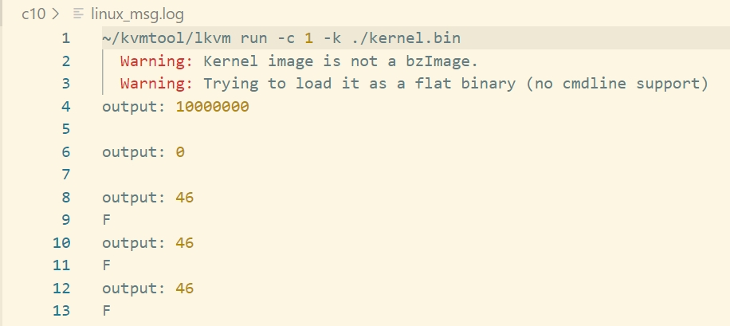
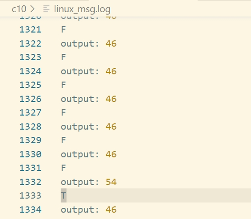

# 第10章 中断和异常

## 1 中断及其处理过程

- 可编程中断控制器8259A的中断从发生到处理的过程：
  1. 一个或多个中断源将连接8259A的IR引脚设置为高电平，外设请求到达8295A。
  2. 收到外设请求信号后，查询中断屏蔽寄存器IMR。如果请求没有屏蔽，将其记录到中断请求寄存器IRR中。
  3. 从寄存器IRR中挑选出优先级最高的中断，向处理器发起中断请求。
  4. 处理器收到中断请求信号后，如果标志寄存器中的IF位被使能，通过引脚INTA向8259A发送中断响应信号，并告知8295A，处理器开始处理中断。
  5. 8259A收到中断确认信号后，将优先级最高的中断请求的向量号通过数据总线发送给处理器，并在ISR中记录下处理器正在处理的中断。
  6. 如果8259A工作在自动复位（AEOI）模式，在收到中断确认信号后，会自动复位ISR。
  7. 处理完中断后，处理器向8259A发送EOI（中断结束）命令。
  8. 8259A收到EOI信号后，复位ISR。

- 高级可编程中断控制器APIC：可以按需将接收到的中断分发给不同的处理器镜像处理。
- MSI：消息信号中断，中断不再基于引脚，而是基于消息。

## 2 初始化8259A

- 8259A有两个I/O端口，主8259A的端口是`0x20`和`0x21`，从主8259A的端口是`0xA0`和`0xA1`。
- 需要初始化连续4个命令字：
  - ICW1：D7\~D5（保留）、D4（1，表示这个一个ICW1）、D3（触发模式，0表示边沿触发）、D2（0）、D1（设置为1，单片模式）、D0（设置为1，表示写入ICW4）。
  - ICW2：D7\~D3（根据起始中断向量号设置，从数字32开始，前32个数字留作异常代码）、D2\~D0（0）
  - ICW3：当不使用级联模式，无需设置ICW3。
  - ICW4：D7\~D5（0）、D4（设置为0，表示固定优先级）、D3（0，缓存模式）、D2（0，主/从模式）、D1（0，关闭自动复位）、D0（设置为1，表示8086及以上系统）

## 3 中断描述符表

- 作用：记录中断处理函数的地址。
- 在实模式下，称为中断向量表（IVT）；在保护模式下，称为中断描述符表（IDT）。
- 使用方式：操作系统负责组织IDT，将IDT地址设置到寄存器IDTR中，当中断请求到来时，处理器获取IDT地址，使用中断向量从IDT中索引到中断处理函数的地址，跳转到中断处理函数进行中断处理。
- 初始化中断描述符表的定义：

```c
// 中断描述符
struct gate_desc {
    uint16_t offset_low; // 中断处理函数地址0~15位
    uint16_t segment; // 段选择子
    uint16_t ist : 3, zero : 5, type : 4, zero2 : 1, dpl : 2, p : 1; // ist：中断栈索引；type：中断类型（中断1110/异常1111）；dpl：特权级；p：存在位
    uint16_t offset_middle; // 中断处理函数地址16~31位
    uint32_t offset_high;  // 中断处理函数地址32~63位
    uint32_t reserved; // 保留
} __attribute__((packed));
```

- 设置中断寄存器：寄存器IDTR的高64位记录中断描述符表的地址，低16位记录中断描述符表的长度。

## 4 时钟中断

- 时钟中断：用于统计每个任务执行的时间，由可编程计数器产生。
- 时钟中断处理函数，将OCW2写入8259A的端口0x20处，设置D5位为1表示处理器已经处理完中断了

```nasm
timer_handler:  
    # 保护上下文  
    SAVE_CONTEXT

    # 将OCW2写入8259A的端口0x20处，D5=1表示处理器已经处理完中断了
    movb $0x20,%al
    outb %al,$0x20

    # 调用do_timer函数
    call do_timer

    # 恢复上下文
    RESTORE_CONTEXT
    # IF位自动复位，再次开启中断
    iretq
```

- 设置时钟中断描述符：设置32号中断号为时钟中断。
- 编程时钟芯片8254：Intel 8254是一个可编程定时/计数器芯片，使用工作模式3，每当收到一个晶振发来的信号，`counter`值减1，当为0时，向8259A发送一个时钟中断信号。
- 频率计算：设置频率为100Hz的中断，即每秒向8259A发送100次时钟信号，可得`counter = 1193181 / 100`。
- 8254控制字：D7\~D6（00，使用计数器0）、D5\~D4（设置11，先写低8位，再写高8位）、D3\~D1（011，表示工作模式3）、D0（设置为0，表示计数值的编码是二进制格式）。

## 5 缺页异常

- 异常的分类：
  - `Fault`：在处理完异常时，处理器会重新执行发生异常的指令。
  - `Trap`：在处理完异常后，处理器会执行异常指令的下一条指令。
  - `Abort`：异常不可以恢复，发生此种异常后，系统终止运行。

## 6 运行结果

运行`make run > linux_msg.log 2>&1`命令，查看`linux_msg.log`，可观察到循环打印应用程序App1中的字符`F`，并且也会打印时钟中断的字符`T`。



