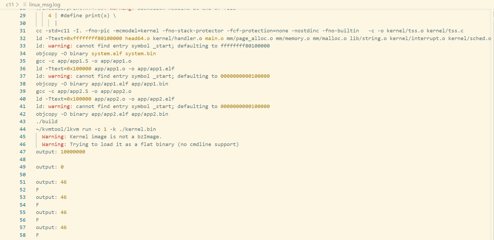
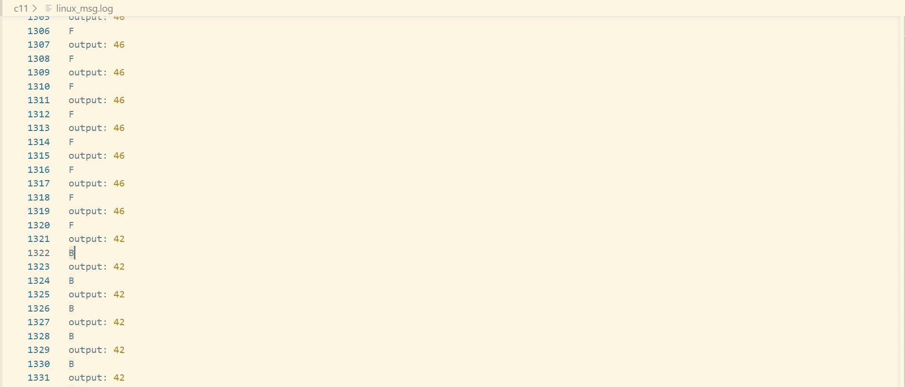

# 第11章 进程调度

## 1 任务状态

新增进程任务状态：
- `TASK_RUNNING`：任务正在运行或就绪态
- `TASK_INTERRUPTIBLE`：任务处于可中断的睡眠态

## 2 创建进程

- 应用程序app2的主要功能：循环向串口输出字符`B`。
- 加载地址：将应用程序app2加载到内核映像文件中偏移`0xd000000`\~`0x10000`处。

## 3 空闲任务

- 空闲任务（idle）：当没有就绪任务需要运行时，让处理器运行这个任务。
- 初始化空闲任务：

```c
// 创建空闲任务
static void make_idle_task() {
    idle_task = malloc(sizeof(struct task));
    idle_task->id = 0;
    idle_task->state = TASK_RUNNING;
    idle_task->pml4 = TASK0_PML4;
    idle_task->kstack = (unsigned long)&task0_stack;
    idle_task->rsp0 = (unsigned long)&task0_stack;
    idle_task->rip = (unsigned long)&idle_task_entry;
}
```

## 4 任务调度

代码详见`codes/implement-an-os-from-scratch/c11/kernel/sched.c`的`do_timer`方法。

- 任务调度算法：简单的时间片轮转算法，以时钟两次中断的间隔作为一个时间片，每个时钟中断到来时，当前任务的时间片耗尽，内核将停止运行当前任务，挑选下一个就绪状态的任务执行，如果没有就绪任务，就执行空闲任务。
- 特别注意：在调用`do_timer`之前，将中断处理完成的命令EOI发送给中断芯片。

## 5 任务切换

- 目标：当发生任务切换时，为了可以恢复运行时被切换走的任务，需要保存任务的上下文，然后将即将投入运行的任务的上下文装载到处理器中。
- 当前任务内核态上下文的保存：
  - 页表：无需保存，任务中已经记录了根页表的物理地址（`pml4`）
  - 内核栈顶：将寄存器RSP的值保存到当前任务的`rsp0`
  - 指令地址：将切换指令后的语句地址保存到当前任务的`rip`
- 恢复即将投入运行任务的内核态的上下文：
  - 页表：将任务的根页表物理地址保存到寄存器CR3中
  - 内核栈顶：将下一个任务的`rsp0`保存到处理器的栈指针寄存器RSP
  - 指令地址：将下一个任务的`rip`压入栈顶，通过`ret`指令弹出到寄存器RIP

## 6 运行结果

运行`make run > linux_msg.log 2>&1`命令，查看`linux_msg.log`，可观察到循环打印应用程序App1中的字符`F`，之后循环打印应用程序App2中的字符`B`。





