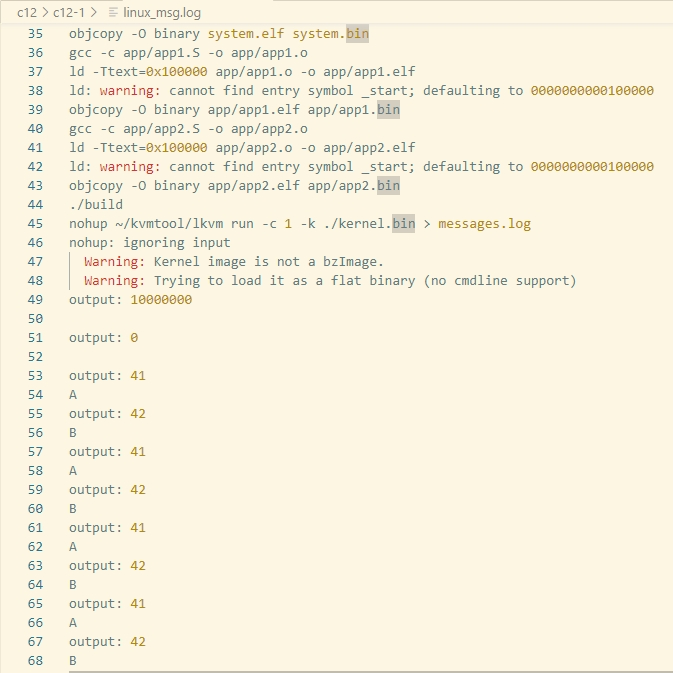
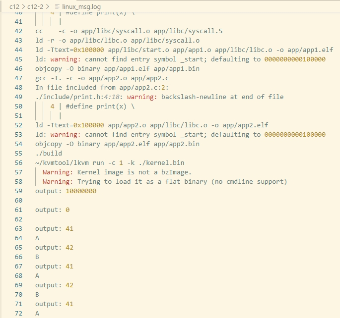

# 第12章 系统调用

## 1 系统调用工作机制

- 64位x86处理器使用指令`syscall`和`sysret`支持应用程序调用操作系统内核中的函数。
- 系统调用流程：
  1. 应用程序将系统调用号装载到寄存器RAX中。
  2. 将参数装载到寄存器RDI、RSI、RDX、R10、R8、R9等中。
  3. 执行指令`syscall`发起系统调用。
  4. 处理器将从MSR寄存器中获取系统段的选择子，加载到CS和SS中，完成特权级的切换。
  5. 将MSR寄存器记录的系统调用入口地址装载到指令指针RIP中，跳转到内核中的系统调用入口。

## 2 内核系统调用入口

- 解决内核系统调用入口的存储问题：任务状态段的`rsp0`存储内核栈地址，`rsp2`存储用户栈顶地址。
- 栈切换：在切换为内核栈后，将任务状态段中的`rsp2`压入进程的内核栈，完成用户栈的保存。执行完系统调用后，返回用户空间前，将内核栈底的用户栈顶恢复到栈指针RSP中。
- 系统调用：使用数组`syscall_table`存储系统调用函数，将系统调用号作为索引。使用`SIB+disp`方式寻址数组元素。

```nasm
system_call:
    # 将当前寄存器RSP中的用户栈顶保存到任务状态段的rsp2，rsp2的基址偏移为20字节
    mov %rsp, tss + 20
    # 将任务状态段的rsp0保存的进程内核栈加载到寄存器RSP中，rsp0的基址偏移为4字节
    mov tss + 4, %rsp

    # 将任务状态段的rsp2的用户栈压入内核栈
    pushq tss + 20
    # 无需保存RAX寄存器
    SAVE_CONTEXT 0

    # 由于位于同一个特权级，使用call调用具体的系统调用
    # 间接跳转
    call *syscall_table(, %rax, 8)

    RESTORE_CONTEXT 0
    # 从内核栈弹出用户栈顶指针RSP，恢复用户栈
    pop %rsp

    sysretq
```

## 3 设置MSR寄存器

MSR寄存器包括STAR、LSTAR和SFMASK：
- STAR：存储`syscall`和`sysret`指令执行时的代码段选择子，在32位模式下，低32位记录系统调用的入口地址。
- LSTAR：保存64位模式下系统调用入口地址。
- SFMASK：用于当应用发起系统调用时，给处理器传递标志，相当于标志寄存器的掩码。

执行`syscall`指令发起系统调用时，处理器执行流程：
1. 处理器取出寄存器STAR中的第32\~47位，作为内核代码段选择子，加载到代码段寄存器CS中。
2. 将上述值加上数字8，作为内核栈段选择子，加载到栈段寄存器SS中。
3. 处理器将标志寄存器的内容存储到寄存器R11中，依据SFMASK中的设置将标志寄存器的对应位清除。
4. 在加载系统调用入口到RIP前，处理器保存RIP中的指令地址，完成系统调用后，处理器才能返回到用户空间发起系统调用后的代码。
5. 处理器将LSTAR中的64位系统调用入口地址装载到指令指针RIP，跳转到内核系统调用入口执行。

完成系统调用后，执行`sysret`返回用户空间时，处理器执行流程：
1. 如果返回到32位模式，将STAR中的第48\~63位，作为用户代码段选择子，加载到代码段寄存器CS中。如果返回64位模式，加上数字16。
2. 处理器取出寄存器STAR的第43\~68位，加上数字8作为用户栈段选择子，加载到栈段寄存器SS中。
3. 从寄存器R11中恢复标志寄存器。
4. 从寄存器RCX中恢复指令指针RIP，返回用户空间。

## 4 实现系统调用sleep

代码详见：`codes/implement-an-os-from-scratch/c12/c12-1/kernel/sched.c`的`do_sleep`和`do_timer`函数。

- 目标：针对两个应用程序App1和App2每隔一段向串口输出一个字符。
- 具体实现：
  - 设置全局变量，用于记录中断发生的次数。
  - 当应用程序调用`sleep`函数，可以设置到期时间`alarm = ticks + ms / 10`，其中`ms / 10`表示将`ms`转换为中断次数。
  - 如果应用程序的执行时间到期，则将任务的状态设置为就绪，然后请求调度系统进行调度，运行到期的任务。

## 5 运行结果-1

运行项目`codes/implement-an-os-from-scratch/c12/c12-1`，执行`make run > linux_msg.log 2>&1`命令，查看`linux_msg.log`，可观察到每隔1秒循环打印应用程序App1中的字符`A`，再间隔1秒打印应用程序App2中的字符`B`。



## 6 创建C代码库

- 当前缺陷：应用程序直接通过指令`syscall`发起系统调用，导致应用和内核紧耦合，应用程序应该有更好的移植性。
- 改进措施：在应用系统和内核直接插入一层，向上为应用提供统一的标准接口，向下负责适配不同的操作系统内核，引入C库。
- 创建`libc`目录，为应用提供统一的标准接口，详见`codes/implement-an-os-from-scratch/c12/c12-2/app/libc/syscall.S`的`sleep`

## 6 运行结果-2

运行项目`codes/implement-an-os-from-scratch/c12/c12-2`，执行`make run > linux_msg.log 2>&1`命令，查看`linux_msg.log`，可观察到每隔1秒循环打印应用程序App1中的字符`A`，再间隔1秒打印应用程序App2中的字符`B`。

