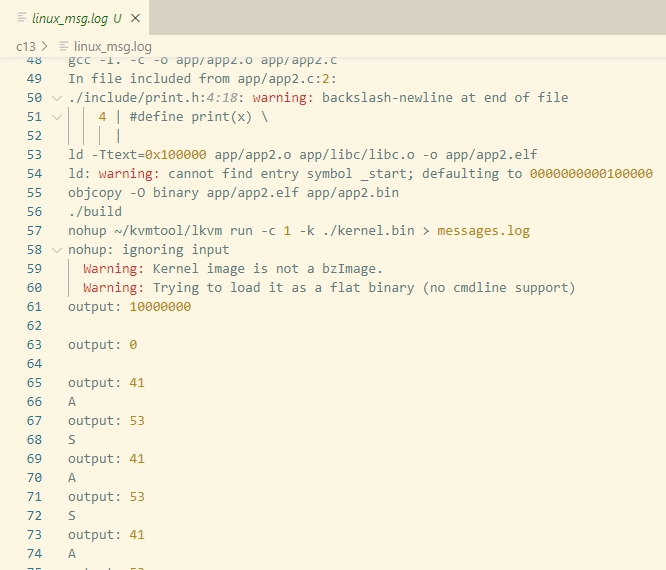

# 第13章 进程间通信

## 1 共享内存原理

- 定义：共享内存是一种常用的进程间通信方式，不同进程通过访问同一块内存区域实现数据共享和交互。
- 目的：通过共享内存，避免数据的复制。 

当一个应用程序申请访问某个共享内存时，具体步骤：
1. 应用程序通过内核提供的系统调用，请求内核创建或者返回已有共享内存的虚拟地址，并将共享内存的名字传给内核。
2. 内核将共享内存名作为关键字，查找共享内存链表，如果共享内存尚未创建，则创建一个`shm`实例，并链接到共享内存链表中。
3. 如果是新创建的实例，还要通过内存页管理分配一个空闲物理页面作为共享内存页，记录到`shm`的`page`字段。
4. 内核在进程的地址空间中的用户空间部分，分配一个页面大小的虚拟内存区域，用于映射共享内存页。
5. 内核在页表中建立虚拟内存区域到共享内存页的映射关系。
6. 内核将虚拟地址返回给应用程序，之后，应用程序可以直接访问共享内存。

## 2 实现内核共享内存

详见代码`codes/implement-an-os-from-scratch/c13/ipc/shm.c`

## 3 运行结果

运行项目`codes/implement-an-os-from-scratch/c13`，执行`make run > linux_msg.log 2>&1`命令，查看`linux_msg.log`，可观察到每隔1秒循环打印应用程序App1中的字符`A`，再间隔1秒打印应用程序App2从App1中读出共享内存的字符`S`。

