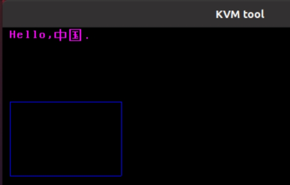
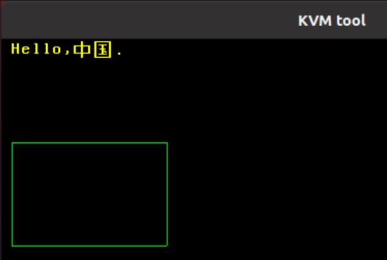
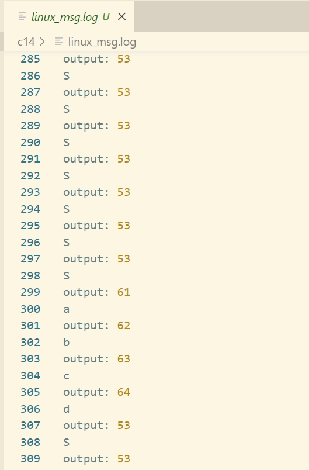

# 第14章 显示及输入

## 1 图形处理器

- 显卡适配器：显卡适配器上有一块存储区域`framebuffer`，将需要显示的信息写入，显示适配器负责解析`framebuffer`中的内容，并传递给显示器输出。
- 图形处理芯片：专门负责渲染图形，GPU可以同时绘制多个像素。

## 2 文本模式和图形模式

- 文本模式：`framebuffer`存储的是以字符为单位的信息，包括字符对应的编码及其属性，第一个字节为字符对应的编码，第2个字节为字符的属性。
- 图形模式：`framebuffer`存储的是以像素为单位的信息，CPU或GPU负责填充每个像素的信息，每个像素信息可以使用多位表示，32位称为RGBA格式，其中1\~3字节表示红绿蓝三原色，第4个字节表示色彩的透明度。

## 3 显卡驱动的实现 

### 3.1 获取模式信息

- 获取模式信息：输入参数寄存器AX设置为`0x4f01`，通过`0x10`号中断，返回模式信息。`VBE`会将模式信息复制到`ES:DI`指定的内存地址处，该地址设置为相对实模式起始偏移`0x4000`处。
- 模式信息的格式：本代码中仅使用`framebuffer`地址（`fbbase`）、分辨率（`hres`和`vres`）、色深。

```c
struct vesa_mode_info {
    uint8_t pad0[18]; 
    uint16_t hres;     // 以像素为单位的水平分辨率
    uint16_t vres;     // 以像素为单位的垂直分辨率

    uint8_t pad1[3];
    uint8_t bpp;       // 每个像素使用的字节数
    uint8_t pad2[14];

    uint32_t fbbase;   // framebuffer占据的地址空间的起始地址

    uint8_t pad3[212];
} __attribute__ ((packed));
```

### 3.2 将`framebuffer`映射到用户空间

- `framebuffer`映射在进程地址空间的起始地址设置为`0xe000000`。
- 调用`map_range`建立映射关系，虚拟地址是`0xe000000`，物理地址是`fbbase`。

```c
// 将framebuffer映射到用户空间
unsigned long do_fbmap() {
    // 固定一个地址作为framebuffer映射在进程的用户空间的起始地址
    unsigned long va = 0xe000000;
    // 物理地址
    unsigned long pa = vesa_mode_info->fbbase;
    // 计算映射长度
    int size = vesa_mode_info->hres * vesa_mode_info->vres * vesa_mode_info->bpp / 8;
    int npage = 0;
    // 进行地址映射，US位设置为1，表示允许运行在特权级为3的用户访问这块内存
    map_range(current->pml4, va, pa, 0x4, (size + PAGE_SIZE - 1) / PAGE_SIZE);

    return va;
}
```

### 3.3 应用获取模式信息

- 定义一个精简的结构体，提供给应用程序获取模式信息。
- 实现一个系统调用`do_get_mode_info`，为应用传递模式信息。

```c
// 为应用传递模式信息
unsigned long do_get_mode_info(struct mode_info *mode_info) {
    mode_info->fbbase = vesa_mode_info->fbbase;
    mode_info->hres = vesa_mode_info->hres;
    mode_info->vres = vesa_mode_info->vres;
    mode_info->bpp = vesa_mode_info->bpp;  

    return 0;
}
```

### 3.4 设计字体

- 使用0和1标识一个像素，0标识的像素使用背景色绘制，1标识的像素使用前景色绘制。
- 定义要展示的字体，代码详见`codes/implement-an-os-from-scratch/c14/app/libdraw/fonts.c`

### 3.5 图形库

代码详见`codes/implement-an-os-from-scratch/c14/app/libdraw/draw.c`

- 目的：将绘制功能实现在图形库`libdraw`中，支撑多个应用复用绘制功能。
- 绘制图形方式：对于一个二维图形，使用两层循环绘制，沿着垂直方向从上向下一行一行绘制。

## 4 键盘输入

- 键盘输入原理：个人计算机的键盘内置了8048芯片，当敲击键盘时，8048将扫描对应的键位被敲击，并将扫描码发送给主板，主板的8042键盘控制器模块接收扫描码，通过8295A发送键盘中断请求。
- 具体实现：
  - 读取键盘的功能用`process_kb`函数实现，从键盘控制器的读端口地址`0x60`处读取扫描码。
  - 键盘中断对应的中断向量号为`0x21`，中断处理函数是`kb_handler`。
  - 每个键有两种状态，分别是按下和释放，按下时的编码称为通码，释放时的编码称为断码。如果持续按下不放，将持续产生通码。

## 5 运行结果

运行项目`codes/implement-an-os-from-scratch/c14`，执行`make run > linux_msg.log 2>&1`命令。

- 可以在弹出的终端界面上看到，每隔1秒显示两种颜色（黄色和紫色）的文字和三种颜色（红色、绿色和蓝色）的矩形图像。





- 查看`linux_msg.log`，可观察到每隔1秒打印应用程序App2从App1中读出共享内存的字符`S`，以及按下键盘响应的字符`a`、`b`、`c`和`d`。

