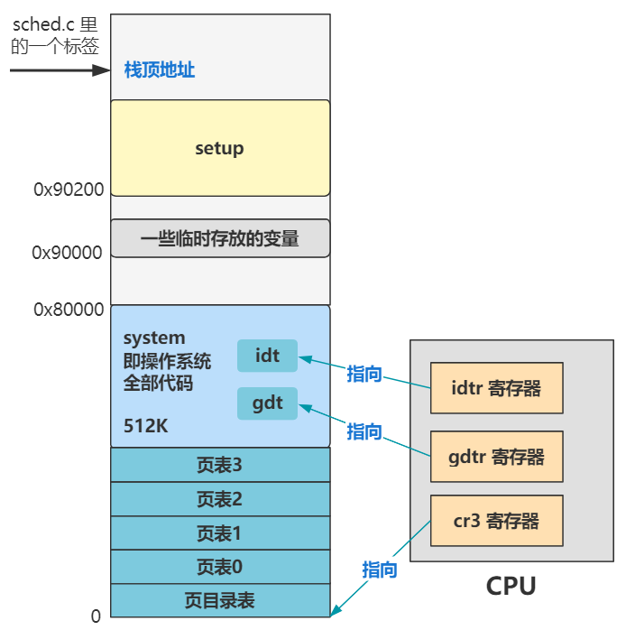

# 《Linux源码趣读》学习笔记

- Linux代码获取地址：https://mirrors.edge.kernel.org/pub/linux/kernel/Historic/old-versions/
- Linux内核版本：V0.11
- 本书资料：https://github.com/dibingfa/flash-linux0.11-talk

## 第一部分 进入内核前的苦力活

本部分共包含10回内容，主要讲述了如下内容：
1. 加载启动区：开机之后，BIOS将硬盘启动区的512字节数据复制到内存`0x7c00`位置。将`0x7c00`的512字节数据移动到`0x90000`位置。设置代码段CS地址为`0x9000`，设置数据段DS地址为`0x9000`，设置栈顶位置指向`0x9FF00`处。
2. 【`bootsect.s`】加载`setup.s`：将硬盘的`setup`代码（第2~5扇区）加载到`0x90200`，将`system`代码（240个扇区）加载到`0x10000`。
3. 【`bootsect.s`】加载内核：将`system`代码复制到`0x00000`处，并将系统信息设置在`0x90000`开始的内存中，包括光标位置、扩展内存数、显示页面等各个设备的参数信息。
4. 【`setup.s`】分段机制：设置全局描述符表GDT。
5. 【`setup.s`】进入保护模式：打开A20地址线，从16位实模式转换到32位保护模式，设置中断描述符表IDT。
6. 【`head.s`】重新设置中断描述符表IDT和全局描述符表GDT。
7. 【`head.s`】开启分页机制。
8. 【`head.s`】跳转到内核：跳转`main`函数。

