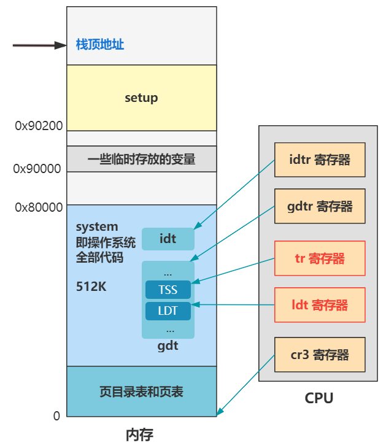

# 《Linux源码趣读》学习笔记

- Linux代码获取地址：https://mirrors.edge.kernel.org/pub/linux/kernel/Historic/old-versions/
- Linux内核版本：V0.11
- 本书资料：https://github.com/dibingfa/flash-linux0.11-talk
- xv6操作系统：https://github.com/mit-pdos/xv6-public

## 第一部分 进入内核前的苦力活

本部分共包含10回内容，主要讲述了如下内容：
1. 加载启动区：开机之后，BIOS将硬盘启动区的512字节数据复制到内存`0x7c00`位置。将`0x7c00`的512字节数据移动到`0x90000`位置。设置代码段CS地址为`0x9000`，设置数据段DS地址为`0x9000`，设置栈顶位置指向`0x9FF00`处。
2. 【`bootsect.s`】加载`setup.s`：将硬盘的`setup`代码（第2\~5扇区）加载到`0x90200`，将`system`代码（240个扇区）加载到`0x10000`。
3. 【`bootsect.s`】加载内核：将`system`代码复制到`0x00000`处，并将系统信息设置在`0x90000`开始的内存中，包括光标位置、扩展内存数、显示页面等各个设备的参数信息。
4. 【`setup.s`】分段机制：设置全局描述符表GDT。
5. 【`setup.s`】进入保护模式：打开A20地址线，从16位实模式转换到32位保护模式，设置中断描述符表IDT。
6. 【`head.s`】重新设置中断描述符表（IDT）和全局描述符表（GDT）。
7. 【`head.s`】开启分页机制。
8. 【`head.s`】跳转到内核：跳转`main`函数。


## 第二部分 “大战”前期的初始化工作

本部分共包含10回内容，主要讲述了如下内容：
1. 【`init/main.c`】整个操作系统的启动分为4步：主内存和缓冲区边界的取值和计算、一系列初始化、切换到用户态模式进行最终的初始化、死循环（等待任务运行）。
2. 【`mm/memory.c`】主内存初始化：使用`mem_map`数组管理内存的使用情况。
3. 【`kernel/traps.c`】中断初始化：初始化`0\~0x10`的中断处理函数。
4. 【`kernel/blk_drv/ll_rw_bkl.c`】块设备请求项初始化：将块设备的读写请求封装为一个`request`结构放到`request[]`数组中进行管理。
5. 【`kernel/chr_drv/console.c`】控制台初始化：结合图形视频缓冲区，实现在控制台输出字符，并可以支持换行、滚屏等操作。
6. 【`init/main.c`】时间初始化：使用CPU对CMOS交互，并获取时间。
7. 【`kernel/sched.c`】进程调度初始化：初始化进程的任务状态段（TSS）和局部描述符表（LDT），初始化`0x20`（时间中断）、`0x21`（键盘中断）和`0x80`（系统调用中断）的中断处理函数。
8. 【`fs/buffer.c`】缓冲区初始化：建立缓冲区的双向链表，每个元素包含缓冲头和1024B的缓冲块。
9. 【`kernel/blk_drv/hd.c`】硬盘初始化：初始化硬盘读写请求，并初始化`0x2E`（硬盘读写中断）的中断处理函数。



## 第三部分 一个新进程的诞生

本部分共包含10回内容，主要讲述了如下内容：
1. 【`move_to_user_mode`函数】从内核态切换到用户态：使用`iretd`指令进行特权级转换和描述符表切换的操作。
2. 【`do_timer`函数】进程调度：每10ms触发一次定时器，CPU查询中断向量表执行时钟中断处理函数，找到一个`counter`值最大并处于`runnable`状态的进程，调用`switch_to`函数保存当前进程的上下文，恢复要跳转的进程上下文，进程就运行起来了。
3. 【`fork`函数】创建新进程：先复制`task_struct`，重新设置元信息和寄存器的信息；对LDT的复制和改造；页表的复制，并采用写时复制机制。
4. 写时复制机制：在调用`fork`函数生成新进程时，新进程与原进程会共享同一个内存区域，只有但其中一个进程进行写操作时，系统才会为其另外分配内存页面。
5. 文件系统：通过超级块、块描述符、`inode`位图、`inode`表、数据块设计硬盘的文件读写。

## 第四部分 shell程序的由来

本部分共包含10回内容，主要讲解了`init/main.c`文件的`init`函数：
1. 【`setup`函数】获取硬盘信息：设置硬盘的基本信息（柱面数、磁头数、写前预补偿柱面号、控制字节、磁头着陆区柱面号、每磁道扇区数），设置硬盘的分区表，加载虚拟内存和根文件系统。
2. 【`mount_root`函数】加载根文件系统：先介绍了文件系统格式（引导块启动区、超级块、`inode`位图、块位图、`inode`、块），主要把硬盘中的文件系统各种信息搬到内存中。
3. 【`sys_open`和`sys_dup`函数】打开终端设备：通过`open`函数生成了0号`fd`，作为标准输入设备。该函数主要通过进程文件描述符数组和系统文件表中找到空闲项并对应起来，再根据文件名从文件系统中查找`inode`，最后对文件描述符的各个属性进行赋值之后返回；通过`dup`函数生成了1号和2号`fd`，分别作为标准输出设备和标准错误输出设备。
4. 创建进程2：通过`fork`函数创建进程2，并以只读形式打开`/etc/rc`文件，将指向标准输入的0号文件描述符重新指向了`/etc/rc`文件，之后执行`/bin/sh`程序。
5. 【`execve`函数】加载并执行`shell`程序：将文件的第一块数据读取到缓冲区，对可执行文件进行校验，对进程管理结构的调整，释放进程占用的页，调整线性地址空间、参数列表、堆栈地址等，最后设置`eip`和`esp`，通过中断恢复，代码会自动跳转到`shell`程序并执行。
6. 【`do_no_page`函数】缺页中断：首先计算所在的页，再得到相对于进程2的偏移地址，最后寻找一个空闲页，并将硬盘中一页数据加载到内存中，调用`put_page`函数完成页表的映射，从而完全缺页的补充。

**注：** gdb target remote报错的解决方案

> warning: Selected architecture i386 is not compatible with reported target architecture i386:x86-64  
warning: Architecture rejected target-supplied description  

这个警告信息表示选择的架构（i386）与目标架构（i386:x86-64）不兼容，我们需要选择一个与目标架构兼容的架构，需要修改gdb的执行参数：

1. 在用户根目录下创建`.gdbinit`文件。
2. 填写以下内容：

```shell
set architecture i386:x86-64
```

3. 再重新执行“启动调试”。

## 第五部分 一条shell命令的执行

本部分共包含9回内容，主要介绍shell命令的执行过程：
1. 整体流程：用户从键盘按下按键后，进入键盘中断处理程序`keyboard_interrupt`，最终通过`put_queue`将字符放入`read_q`队列；通过`copy_to_cooked`函数，经过`termios`规则处理，将处理过的字符放入`secondary`（`read_q`队列里的未处理字符）；进程通过`tty_read`从`secondary`里读字符，通过`tty_write`将字符写入`write_q`中，再通过`con_write`控制台写函数，将字符打印到显示器上。
2. 【`read`函数】`shell`程序会通过`getcmd`函数，最终调用`read`函数读入一个个字符；`sys_read`读操作函数整合了管道文件、字符设备文件、块设备文件、目录文件或普通文件的读取，调用`rw_char`函数计算主设备号和次设备号，根据`crw_table`得到对应的`rw_ttyx`函数，之后不断从`secondary`队列中读取字符，放入`buf`指向的内存中。
3. 进程链中的进程唤醒机制：当进程阻塞的时候，逐步构建进程链，当某个进程调用了`wake_up`函数，唤醒了进程链上指向的第一个进程，会在`sleep_on`函数执行完`schedule`后被唤醒，同时将`tmp`指针指向上一个进程，该进程也同样被唤醒。
4. 管道的创建：`runcmd`函数调用`sys_pipe`函数创建了两个进程，左边的进程的标准输出指向管道的写口，右边的进程的标准输入指向管道的读口。
5. 读取硬盘数据流程：通过`verify_area`对内存进行校验，如果缺页，使用写时复制方法；通过`file_read`对读盘进行操作，通过`bmap`获取硬盘全局的数据块号，使用`bread`函数将数据块复制到缓冲区，并利用`put_fs_byte`函数将将缓冲块数据复制到用户指定的内存中。
6. 【`ll_rw_block`函数】当设备的当前请求项为空时，直接执行`do_hd_request`函数发起读盘请求；硬盘发起读或写请求，请求执行完毕后会发起硬盘中断，调用`read_intr`中断处理函数，该函数会改变当前请求项指针，指向`request`链表的下一个请求项，再次调用`do_hd_request`函数。不断处理`request`链表中的一个个硬盘请求项。
7. 信号的处理：当按下`Ctrl+C`组合键时，操作系统执行键盘中断处理函数，并调用`copy_to_cooked`函数，当发现字符是中断字符时，调用`tty_intr`函数给所有组号为`tty`的进程发送信号，将进程的`signal`相应的位置设置为1。