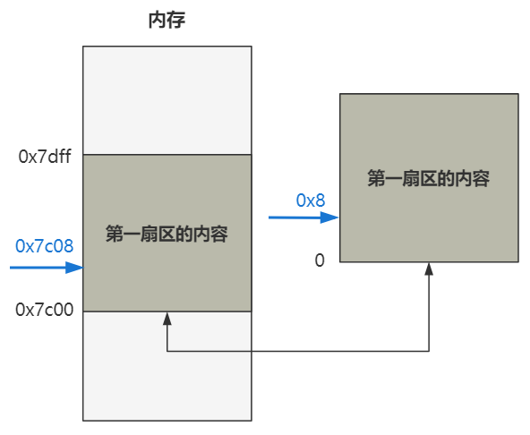

# 第1回 Linux开机初始化

- 开机后初始化指向BIOS：开机后，CPU初始化PC寄存器为`0xFFFF0`，然后按照PC寄存器的值到内存中对应的地址寻找这条指令执行。
- 读取硬盘启动区（第一扇区）：硬盘第一扇区的512字节的最后两个字节分别是`0x55`和`0xaa`，将512字节的二进制数据从硬盘搬运到内存。该数据是`boot/bootsect.s`的二进制文件，存放在启动区的第一个扇区。
- 加载到内存`0x7c00`位置，并跳转到这里：如下代码表示把`0x07c0`复制到ax寄存器，再复制到ds寄存器。为了CPU在16位实模式下能访问20位地址线，左移4位得到`0x7c00`。

```nasm
BOOTSEG = 0x07c0
start: 
  mov ax,#BOOTSEG
  mov ds,ax
```

