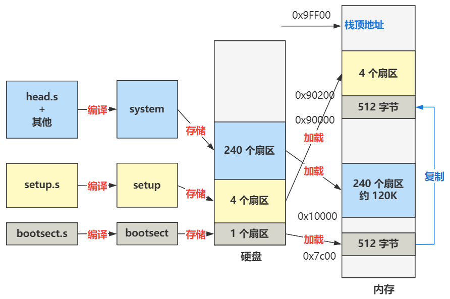

# 第4回 把全部的操作系统代码从硬盘搬到内存

代码路径：`boot/bootsect.s`

## 4.1 把剩下的操作系统代码从硬盘搬到内存

```nasm
SETUPLEN = 4			     ; nr of setup-sectors

load_setup:
    mov	dx,#0x0000		; drive 0, head 0
    mov	cx,#0x0002		; sector 2, track 0
    mov	bx,#0x0200		; address = 512, in INITSEG
    mov	ax,#0x0200+SETUPLEN	; service 2, nr of sectors
    int	0x13              ; read it
```

上述代码主要作用：从硬盘的第2个扇区开始，把数据加载到内存的`0x90200`处，共加载4个扇区。

```nasm
load_setup:
    jnc	ok_load_setup       ; ok - continue
    mov	dx,#0x0000
    mov	ax,#0x0000          ; reset the diskette
    int	0x13
    j	load_setup
```

上述代码主要作用：如果成功，就跳转到`ok_load_setup`标签的代码，如果失败，就重复执行本段代码。

```nasm
SYSSEG   = 0x1000       ; system loaded at 0x10000 (65536).
SETUPSEG = 0x9020       ; setup starts here

ok_load_setup:
    ...
	mov	ax,#SYSSEG
	mov	es,ax		; segment of 0x010000
	call	read_it
    ...
	jmpi	0,SETUPSEG
```

上述代码主要作用：把从硬盘第6个扇区开始往后的240个扇区，加载到内存`0x10000`处，再跳转到`0x90200`处（硬盘第2个扇区开始的位置）。

## 4.2 操作系统的编译过程

操作系统的编译过程是通过`Makefile`和`build.c`完成，过程如下：
1. 把`bootsect.s`编译成`bootsect`放在硬盘的第1扇区。
2. 把`setup.s`编译成`setup`放在硬盘的第2\~5扇区。
3. 把剩下的全部代码（`head.s`作为开头，与各种`.c`和其他`.s`等文件一起）编译并链接成`system`放在硬盘随后的240个扇区中。

