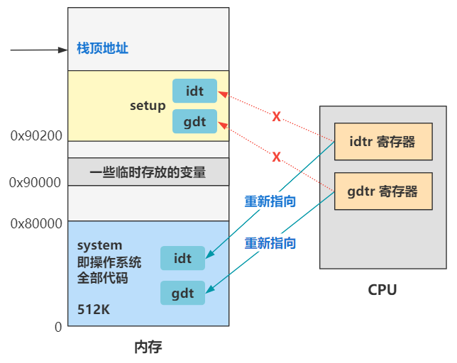

# 第8回 重新设置中断描述符表与全局描述符表

代码路径：`boot/head.s`

## 8.1 前情回顾

- 配置全局描述符表和中断描述符表。
- 打开A20地址线，突破20位寻址。
- 更改CR0寄存器，从实模式切换到保护模式。
- 跳转到内存地址0处开始执行代码。

## 8.2 设置user_stack的栈顶指针

```nasm
_pg_dir:
startup_32:
	movl $0x10,%eax
	mov %ax,%ds
	mov %ax,%es
	mov %ax,%fs
	mov %ax,%gs
	lss _stack_start,%esp
``` 

上述代码解析：
- `_pg_dir`表示页目录，之后在设置分页机制时，页目录会存放在这里，也会覆盖这里的代码。
- 将DS、ES、FS、GS寄存器都赋值为`0x10`，这些值都指向全局描述符表中的第二个段描述符，即数据段描述符。
- `lss`指令表示让栈顶指针指向`_stack_start`标号处。

## 8.3 重新设置中断描述符表

```nasm
call setup_idt
call setup_gdt
movl $0x10,%eax		; reload all the segment registers
mov %ax,%ds		; after changing gdt. CS was already
mov %ax,%es		; reloaded in 'setup_gdt'
mov %ax,%fs
mov %ax,%gs
lss _stack_start,%esp
```

上述代码解析：
- 设置中断描述符表和全局描述符表
- 由于修改了全局描述符表，需要重新设置一遍这些段寄存器。

```nasm
setup_idt:
	lea ignore_int,%edx
	movl $0x00080000,%eax
	movw %dx,%ax		/* selector = 0x0008 = cs */
	movw $0x8E00,%dx	/* interrupt gate - dpl=0, present */

	lea _idt,%edi
	mov $256,%ecx
rp_sidt:
	movl %eax,(%edi)
	movl %edx,4(%edi)
	addl $8,%edi
	dec %ecx
	jne rp_sidt
	lidt idt_descr
	ret
idt_descr:
	.word 256*8-1		# idt contains 256 entries
	.long _idt
_idt:	.fill 256,8,0		# idt is uninitialized
```

上述代码解析：
- 中断描述符表中存储着中断描述符，每个中断号对应一个中断描述符，中断描述符主要存储着中断程序的地址。
- 设置256个中断描述符，初始化每个描述符的中断程序指向一个`ignore_int`函数地址。

## 8.4 重新设置全局描述符表

```nasm
setup_gdt:
	lgdt gdt_descr
	ret
	
gdt_descr:
	.word 256*8-1		# so does gdt (not that that's any
	.long _gdt		# magic number, but it works for me :^)	

_gdt:
	.quad 0x0000000000000000	/* NULL descriptor */
	.quad 0x00c09a0000000fff	/* 16Mb */
	.quad 0x00c0920000000fff	/* 16Mb */
	.quad 0x0000000000000000	/* TEMPORARY - don't use */
	.fill 252,8,0			/* space for LDT's and TSS's etc */	
```

上述代码解析：
- 设置第1个描述符为空。
- 设置第2个描述符（代码段）为16Mb。
- 设置第3个描述符（数据段）为16Mb。
- 设置第4个描述符为空。
- 设置后面252项都为空，预留给TSS和LDT。

