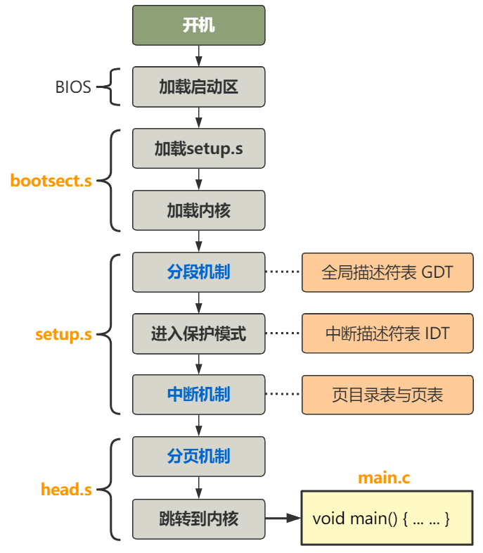

# 第10回 进入main函数前的最后一跃

## 10.1 跳转main函数

代码路径：`boot/head.s`

```nasm
after_page_tables:
	pushl $0		# These are the parameters to main :-)
	pushl $0
	pushl $0
	pushl $L6		# return address for main, if it decides to.
	pushl $_main
	jmp setup_paging
L6:
	jmp L6			# main should never return here, but
				# just in case, we know what happens.
```

当遇到`ret`指令时，CPU将栈顶的值当作返回地址并跳转执行，把ESP寄存器（栈顶地址）所指向的内存处的值赋给EIP寄存器，所以CS:EIP就是CPU要执行的下一条指令的地址。

## 10.2 跳转main之前的工作



## 10.3 当前内存布局图

