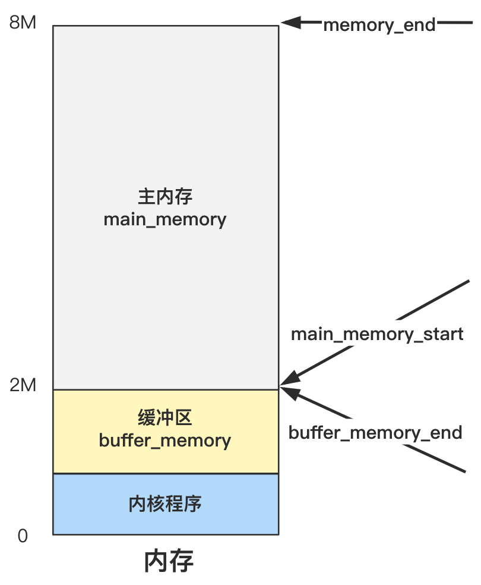

# 第12回 管理内存前先划分出三个边界值

代码路径：`init/main.c`

```c
#define EXT_MEM_K (*(unsigned short *)0x90002)
#define DRIVE_INFO (*(struct drive_info *)0x90080)
#define ORIG_ROOT_DEV (*(unsigned short *)0x901FC)

void main(void)		/* This really IS void, no error here. */
{			/* The startup routine assumes (well, ...) this */
/*
 * Interrupts are still disabled. Do necessary setups, then
 * enable them
 */
    ROOT_DEV = ORIG_ROOT_DEV;
    drive_info = DRIVE_INFO;
    memory_end = (1<<20) + (EXT_MEM_K<<10);
    memory_end &= 0xfffff000;
    if (memory_end > 16*1024*1024)
        memory_end = 16*1024*1024;
    if (memory_end > 12*1024*1024) 
        buffer_memory_end = 4*1024*1024;
    else if (memory_end > 6*1024*1024)
        buffer_memory_end = 2*1024*1024;
    else
        buffer_memory_end = 1*1024*1024;
    main_memory_start = buffer_memory_end;
#ifdef RAMDISK
    main_memory_start += rd_init(main_memory_start, RAMDISK*1024);
#endif
    ...
}
```

- 如果内存大于等于16MB，缓冲区为4MB。
- 如果内存大于6MB，缓冲区为2MB。
- 如果内存小于等于6MB，缓冲区为1MB。

该段代码确定了主内存的起始地址`main_memory_start`、内存的结束地址`memory_end`、缓冲区的结束地址`buffer_memory_end`。

