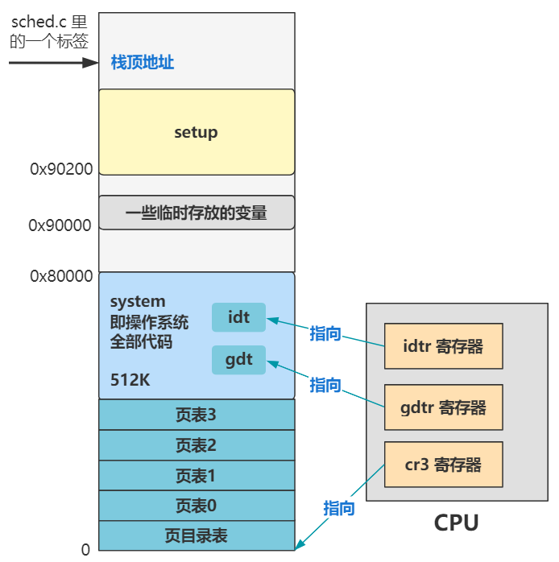

# 第14回 中断初始化`trap_init`

## 14.1 代码解读

代码路径：`kernel/traps.c`

```c
void trap_init(void)
{
	int i;
    
    // 设置trap_gate
	set_trap_gate(0,&divide_error);
	set_trap_gate(1,&debug);
	set_trap_gate(2,&nmi);
    // 设置system_gate
	set_system_gate(3,&int3);	/* int3-5 can be called from all */
	set_system_gate(4,&overflow);
	set_system_gate(5,&bounds);
	set_trap_gate(6,&invalid_op);
	set_trap_gate(7,&device_not_available);
	set_trap_gate(8,&double_fault);
	set_trap_gate(9,&coprocessor_segment_overrun);
	set_trap_gate(10,&invalid_TSS);
	set_trap_gate(11,&segment_not_present);
	set_trap_gate(12,&stack_segment);
	set_trap_gate(13,&general_protection);
	set_trap_gate(14,&page_fault);
	set_trap_gate(15,&reserved);
	set_trap_gate(16,&coprocessor_error);
    // 设置17~48中断号
	for (i=17;i<48;i++)
		set_trap_gate(i,&reserved);
	set_trap_gate(45,&irq13);
	outb_p(inb_p(0x21)&0xfb,0x21);
	outb(inb_p(0xA1)&0xdf,0xA1);
	set_trap_gate(39,&parallel_interrupt);
}
```

上述代码主要功能：
- 在中断描述符表中初始化一个个中断描述符。
- 当CPU执行一条指令时，从硬件层面发起一个中断，然后执行由操作系统定义的异常处理函数。
- 第17~48号中断被暂时设置为`reserved`中断处理程序。



## 14.2 键盘响应

```c
// init/main.c
void main(void) {
    ...
    trap_init();
    ...
    tty_init();
    ...
}

// kernel/chr_drv/tty_io.c
void tty_init(void) {
    rs_init();
    con_init();
}

// kernel/chr_drv/console.c
void con_init(void) {
    ...
    set_trap_gate(0x21,&keyboard_interrupt);
    ...
}
```

上述代码添加了键盘中断处理程序的21号中断到中断描述符表中。