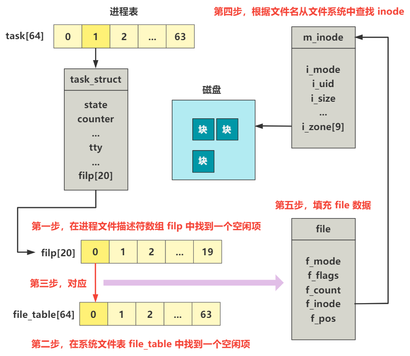

# 第15回 块设备请求项初始化`blk_dev_init`

## 15.1 代码解读

代码路径：`kernel/blk_drv/ll_rw_blk.c`

```c
#define NR_REQUEST 32

void blk_dev_init(void) {
    int i;
    
    for (i=0 ; i<NR_REQUEST ; i++) {
        request[i].dev = -1;
        request[i].next = NULL;
    }
}
```

上述代码对32个块设备进行初始化：设备空闲，并且下一个请求项为空。

## 15.2 `request`结构

代码路径：`kernel/blk_drv/blk.h`

```c
struct request {
    int dev;		/* -1 if no request */
    int cmd;		/* READ or WRITE */
    int errors;
    unsigned long sector;
    unsigned long nr_sectors;
    char * buffer;
    struct task_struct * waiting;
    struct buffer_head * bh;
    struct request * next;
};
```

结构说明：
- dev：设备号，-1表示空闲。
- cmd：命令，设置为`READ`或`WRITE`，表示本次操作是读还是写。
- errors：操作时产生的错误次数。
- sectors：起始扇区。
- nr_sectors：扇区数。
- buffer：数据缓冲区，读盘之后的数据在内存的位置。
- waiting：表示一个进程，由哪个进程发起的这个请求。
- bh：缓冲区头指针。
- next：指向下一个请求项。

上述`request`结构作为访问块设备和内存缓冲区之间的桥梁。

