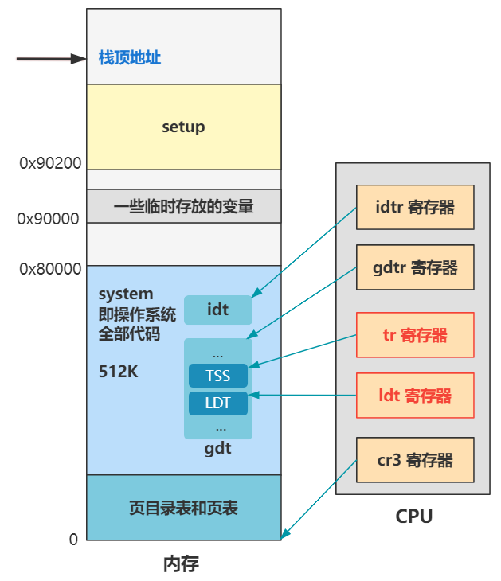

# 第18回 进程调度初始化`sched_init`

## 18.1 初始化TSS和LDT

```c
// kernel/sched.c
#define FIRST_TSS_ENTRY 4
#define FIRST_LDT_ENTRY (FIRST_TSS_ENTRY+1)

void sched_init(void) {
    int i;
    struct desc_struct * p;

    if (sizeof(struct sigaction) != 16)
        panic("Struct sigaction MUST be 16 bytes");
    set_tss_desc(gdt+FIRST_TSS_ENTRY, &(init_task.task.tss));
    set_ldt_desc(gdt+FIRST_LDT_ENTRY, &(init_task.task.ldt));
    ...
}
```

- TSS：任务状态段，用于保存和恢复进程的上下文，里面存储着各种寄存器的值。
- LDT：局部描述符表，用于用户进程中的数据段和代码段，区别于GDT的内核态使用场景。



## 18.2 初始化进程列表

```c
// kernel/sched.c
typedef struct desc_struct {
    unsigned long a,b;
} desc_table[256];

struct task_struct * task[NR_TASKS] = {&(init_task.task), };

void sched_init(void) {
    ...
    p = gdt+2+FIRST_TSS_ENTRY;
    for(i=1;i<NR_TASKS;i++) {
        task[i] = NULL;
        p->a=p->b=0;
        p++;
        p->a=p->b=0;
        p++;
    }
    ...
}
```

上述代码：
- 给一个长度为64、元素为`task_struct`结构的数组`task[64]`初始化。
- 给GDT剩余的位置填充0，即把剩余留给TSS和LDT的描述符都初始化为空。

结合上述代码可以得出：
- 每创建一个新进程，就会在后面添加一组TSS和LDT，表示这个进程的状态任务段及局部描述符表信息。
- 当前正在运行的代码会作为未来的一个进程的指令流。

## 18.3 TR寄存器和LDT寄存器初始化

```c
// kernel/sched.c
#define ltr(n) __asm__("ltr %%ax"::"a" (_TSS(n)))
#define lldt(n) __asm__("lldt %%ax"::"a" (_LDT(n)))

void sched_init(void) {
    ...
    ltr(0);
    lldt(0);
    ...
}
```

- `ltr`函数：给TR寄存器赋值，表示CPU任务状态段在内存中的位置。
- `lldt`函数：给LDT寄存器赋值，表示CPU局部描述符在内存中的位置。

## 18.4 时钟中断和系统调用中断初始化

```c
// kernel/sched.c

void sched_init(void) {
    ...
    outb_p(0x36,0x43);		/* binary, mode 3, LSB/MSB, ch 0 */
    outb_p(LATCH & 0xff , 0x40);	/* LSB */
    outb(LATCH >> 8 , 0x40);	/* MSB */
    set_intr_gate(0x20,&timer_interrupt);
    outb(inb_p(0x21)&~0x01,0x21);
    set_system_gate(0x80,&system_call);
}
```

上述代码：
- 表示CPU与可编程定时器芯片的交互，开启定时器之后，便会持续地、以一定频率地向CPU发出中断信号。
- `0x20`中断号：表示时钟中断，中断处理程序是`timer_interrupt`，用于操作系统通过强制手段回收进程的CPU执行权限。
- `0x80`中断号：表示系统调用中断，中断处理函数是`system_call`，用于用户态程序调用内核提供的函数。

## 18.5 当前中断初始化总结

|   中断号   |       中断处理函数       |
|:-------:|:------------------:|
| 0\~0x10 | trap_init里面设置的中断函数 |
|  0x20   |  timer_interrupt   |
|  0x21   | keyboard_interrupt |
|  0x80   |    system_call     |

> 操作系统实际上就是一个靠中断驱动的死循环，各个模块不断初始化各种中断处理函数，并且开启指定的外设开关，让操作系统自己慢慢“活”了起来，成了一个不断等待或忙碌于各种中断的存在。

 
