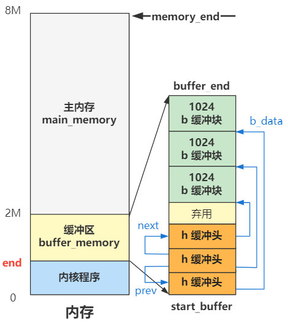

# 第19回 缓冲区初始化`buffer_init`

## 19.1 `start_buffer`的计算

```c
// fs/buffer.c
extern int end;
struct buffer_head * start_buffer = (struct buffer_head *) &end;

void buffer_init(long buffer_end) {
    struct buffer_head * h = start_buffer;
    ...
}
```

- `end`是一个外部变量，由链接器ld在链接整个程序时设置的。
- 在程序编译链接时，由链接器程序计算内核程序末端的地址。

## 19.2 给缓冲头和缓存块分配空间

```c
// fs/buffer.c
void buffer_init(long buffer_end) {
    struct buffer_head * h = start_buffer;
    void * b;
    int i;
    
    if (buffer_end == 1<<20) {
        b = (void *) (640*1024);
    } else {
        b = (void *) buffer_end;
    }
    while ( (b -= BLOCK_SIZE) >= ((void *) (h+1)) ) {
        h->b_dev = 0;
        h->b_dirt = 0;
        h->b_count = 0;
        h->b_lock = 0;
        h->b_uptodate = 0;
        h->b_wait = NULL;
        h->b_next = NULL;
        h->b_prev = NULL;
        h->b_data = (char *) b;
        h->b_prev_free = h-1;
        h->b_next_free = h+1;
        h++;
        NR_BUFFERS++;
        if (b == (void *) 0x100000)
        b = (void *) 0xA0000;
    }
    h--;
    free_list = start_buffer;
    free_list->b_prev_free = h;
    h->b_next_free = free_list;
    ...
}
```

- 缓冲头`h`的地址为`start_buffer`指向的地址。
- 缓冲块`b`的地址为`buffer_end`指向的地址。
- 遍历所有缓冲块，每个缓冲块1024B，并分配一个缓冲头；缓冲头用于寻找缓冲块的。
- 建立双向空闲链表：缓冲头就是具体缓冲块的管理结构，而`free_list`开头的双向链表优势缓冲头的管理结构。
- 双向链表的作用：从`free_list`指向的第一个结构中，可以在链表中遍历到任何一个缓冲头结构，并且找到缓冲头对应的缓冲块。



## 19.3 初始化哈希表`hash_table`

```c
// fs/buffer.c
void buffer_init(long buffer_end) {   
    ...
    for (i=0;i<NR_HASH;i++)
        hash_table[i]=NULL;
}
```

主要作用：直接从哈希表中查找缓冲块，避免频繁遍历双向链表，作为缓冲区的缓存，存储需要查找的缓冲块。