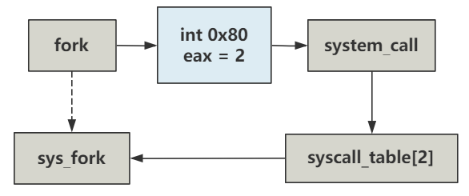

# 第25回 通过`fork`看一次系统调用

## 25.1 `fork`函数的执行

```c
// init/main.c
static inline _syscall0(int,fork)

// include/unistd.h
#define __NR_fork	2

#define _syscall0(type,name) \
type name(void) \
{ \
long __res; \
__asm__ volatile ("int $0x80" \
	: "=a" (__res) \
	: "0" (__NR_##name)); \
if (__res >= 0) \
	return (type) __res; \
errno = -__res; \
return -1; \
}
```

将上述代码的参数带入，可得到下述代码：

```c
int fork(void) {
    volatile long __res;
    _asm {
        _asm mov eax, __NR_fork
        _asm int 80h
        _asm mov __res, eax
    }
    if (__res >= 0)
        return (int) __res;
    errno = -__res;
    return -1;
}
```

当前代码触发了`0x80`中断号，对应的中断处理函数是`system_call`，且`eax`为2。

## 25.2 系统调用与`_sys_fork`执行

```nasm
// kernel/system_call.s
_system_call:
	cmpl $nr_system_calls-1,%eax
	ja bad_sys_call
	push %ds
	push %es
	push %fs
	pushl %edx
	pushl %ecx		# push %ebx,%ecx,%edx as parameters
	pushl %ebx		# to the system call
	movl $0x10,%edx		# set up ds,es to kernel space
	mov %dx,%ds
	mov %dx,%es
	movl $0x17,%edx		# fs points to local data space
	mov %dx,%fs
	call _sys_call_table(,%eax,4)
	pushl %eax
	movl _current,%eax
	cmpl $0,state(%eax)		# state
	jne reschedule
	cmpl $0,counter(%eax)		# counter
	je reschedule
```

代码解读：
- 由于通过`0x80`中断号触发的，已经入栈了`SS`、`ESP`、`EFLAGS`、`CS`、`EIP`。
- 代码中又入栈了`ds`、`es`、`fs`、`edx`、`ecx`、`ebx`、`eax`。
- 调用`_sys_call_table`函数，到`sys_call_table[]`表中找到下标为2的值是`sys_fork`。
- 调用`sys_fork`函数。

```nasm
// kernel/system_call.s
_sys_fork:
	call _find_empty_process
	testl %eax,%eax
	js 1f
	push %gs
	pushl %esi
	pushl %edi
	pushl %ebp
	pushl %eax
	call _copy_process
	addl $20,%esp
1:	ret
```

