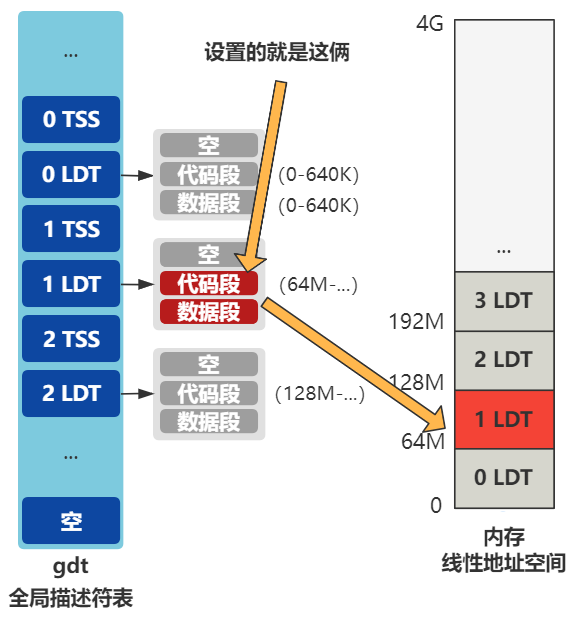
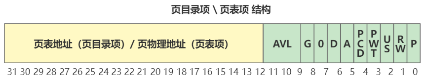

# 第27回 透过`fork`来看进程的内存规划

## 27.1 局部描述符表LDT赋值

```c
// kernel/fork.c
int copy_mem(int nr,struct task_struct * p) {
    unsigned long old_data_base,new_data_base,data_limit;
    unsigned long old_code_base,new_code_base,code_limit;
    
    code_limit=get_limit(0x0f);
    data_limit=get_limit(0x17);
    old_code_base = get_base(current->ldt[1]);
    old_data_base = get_base(current->ldt[2]);
    if (old_data_base != old_code_base)
        panic("We don't support separate I&D");
    if (data_limit < code_limit)
        panic("Bad data_limit");
    new_data_base = new_code_base = nr * 0x4000000;
    p->start_code = new_code_base;
    set_base(p->ldt[1],new_code_base);
    set_base(p->ldt[2],new_data_base);
    ...
}
```

分段讲解代码：
- 获取代码段和数据段的长度，该值为640KB。

```c
code_limit=get_limit(0x0f);
data_limit=get_limit(0x17);
```

- 计算段基址：取决于当前进程号，表示以后每个进程的线性地址空间，都通过错开段基址的方式，分别在线性地址空间划分64MB的空间。

```c
new_data_base = new_code_base = nr * 0x4000000;
```

- 将划分好的空间设置到当前进程的LDT的代码段和数据段表示的起始地址。

```c
set_base(p->ldt[1],new_code_base);
set_base(p->ldt[2],new_data_base);
```



## 27.2 页表的复制

```c
// kernel/fork.c
int copy_mem(int nr,struct task_struct * p) {
    ...
    // old=0, new=64MB, limit=640KB
    if (copy_page_tables(old_data_base,new_data_base,data_limit)) {
        free_page_tables(new_data_base,data_limit);
        return -ENOMEM;
    }
    return 0;
}

// mm/memory.c
int copy_page_tables(unsigned long from,unsigned long to,long size)
{
    unsigned long * from_page_table;
    unsigned long * to_page_table;
    unsigned long this_page;
    unsigned long * from_dir, * to_dir;
    unsigned long nr;
    
    if ((from&0x3fffff) || (to&0x3fffff))
        panic("copy_page_tables called with wrong alignment");
    from_dir = (unsigned long *) ((from>>20) & 0xffc); /* _pg_dir = 0 */
    to_dir = (unsigned long *) ((to>>20) & 0xffc);
    size = ((unsigned) (size+0x3fffff)) >> 22;
    for( ; size-->0 ; from_dir++,to_dir++) {
        if (1 & *to_dir)
            panic("copy_page_tables: already exist");
        if (!(1 & *from_dir))
            continue;
        from_page_table = (unsigned long *) (0xfffff000 & *from_dir);
        if (!(to_page_table = (unsigned long *) get_free_page()))
            return -1;	/* Out of memory, see freeing */
        *to_dir = ((unsigned long) to_page_table) | 7;
        nr = (from==0)?0xA0:1024;
        for ( ; nr-- > 0 ; from_page_table++,to_page_table++) {
            this_page = *from_page_table;
            if (!(1 & this_page))
                continue;
            // 保证页表项只读，写时复制机制
            this_page &= ~2;
            *to_page_table = this_page;
            if (this_page > LOW_MEM) {
                *from_page_table = this_page;
                this_page -= LOW_MEM;
                this_page >>= 12;
                mem_map[this_page]++;
            }
        }
    }
    invalidate();
    return 0;
}
```

代码解读：
- 主要解决将两个进程的页表指向同一个物理空间地址。
- 举一个例子说明：
  - 进程0的虚拟地址是`0x03`，由于进程0的`LDT`代码段基址是0，线性地址是`0x03`，所以进程0页表映射的物理地址是`0x03`。
  - 进程1的虚拟地址是`0x03`，进程1的`LDT`代码段基址是64M，线性地址是64M+3，但最终由进程1页表映射的物理地址也需要是`0x03`。
- 可采用分页机制：
  - 进程1需要找的是页目录项16中的第0号页表
  - 进程0需要找的是页目录项0中的第0号页表
  - 以上两个页表的数据一样即可，这就是上述代码的作用，进行两个页表的数据复制。

## 27.3 注意事项



**注意：** 页表地址或页物理地址需要在该结构中去掉低3位。