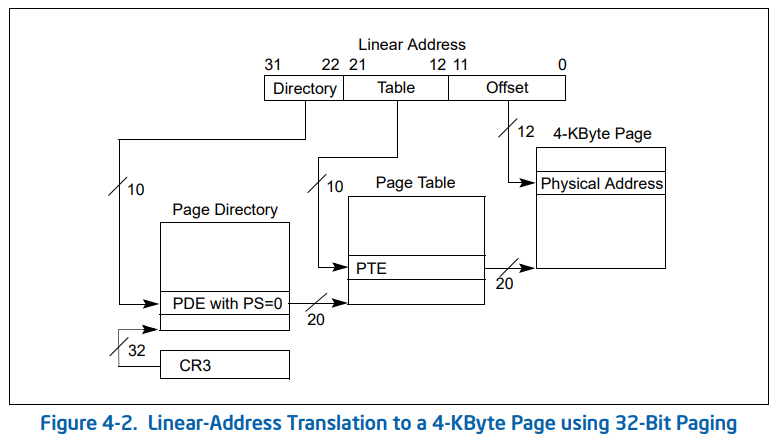

# 第29回 番外篇：写时复制——就这么几行代码

## 29.1 页目录表和页表

- 地址转换：一个由程序员给出的逻辑地址，需要先经过分段机制转换为线性地址，然后再经过分页机制转换为物理地址。

- 分页机制：

    

- 页目录表和页表

    
    
  - 第12\~31位：页表地址/页物理地址。
  - 第0位：P位，表示存在位。
  - 第1位：RW位，表示读写权限，0表示只读，1表示可读写。
  - 第2位：US位，0表示内核态，1表示用户态。

## 29.2 写时复制的本质

- 表面现象：在调用`fork`函数生成新进程时，新进程与原进程会共享同一个内存区域，只有但其中一个进程进行写操作时，系统才会为其另外分配内存页面。
- 详细解读：
  - 当创建新进程时，由于复制物理地址空间的内容费事，先只复制页表，使得两个页表将两个进程的不同线性地址空间映射到同一个物理地址空间。
  - 如果有写操作，那就需要把物理地址空间里的内容再复制一份，保证内存隔离。

## 29.3 代码解读

通过缺页中断实现写时复制，触发`0x14`号中断，对应的中断处理函数是`page_fault`。

```nasm
// mm/page.s
_page_fault:
	xchgl %eax,(%esp)
	pushl %ecx
	pushl %edx
	push %ds
	push %es
	push %fs
	movl $0x10,%edx
	mov %dx,%ds
	mov %dx,%es
	mov %dx,%fs
	movl %cr2,%edx
	pushl %edx
	pushl %eax
	testl $1,%eax
	jne 1f
	call _do_no_page
	jmp 2f
1:	call _do_wp_page
2:	addl $8,%esp
	pop %fs
	pop %es
	pop %ds
	popl %edx
	popl %ecx
	popl %eax
	iret
```

- 出错码(error_code)由CPU自动产生并压入堆栈中。
- 由缺页引起的页异常中断，即页表项存在位P为0时触发，通过调用`do_no_page(error_code, address)`处理。
- 由页写保护引起的异常中断，即页表项RW为0时触发，通过调用`do_wp_page(error_code, address)`处理。
- 出现异常时访问的线性地址是从CR2寄存器得到，专门用于存放页出错时的线性地址。

```c
// mm/memory.c
void do_wp_page(unsigned long error_code,unsigned long address)
{
#if 0
/* we cannot do this yet: the estdio library writes to code space */
/* stupid, stupid. I really want the libc.a from GNU */
    if (CODE_SPACE(address))
        do_exit(SIGSEGV);
#endif
    un_wp_page((unsigned long *)
        (((address>>10) & 0xffc) + (0xfffff000 &
        *((unsigned long *) ((address>>20) &0xffc)))));

}

void un_wp_page(unsigned long * table_entry)
{
    unsigned long old_page,new_page;
    
    old_page = 0xfffff000 & *table_entry;
    // 只被引用一次，说明没有被共享，那只需要改成读写属性即可。
    if (old_page >= LOW_MEM && mem_map[MAP_NR(old_page)]==1) {
        *table_entry |= 2;
        invalidate();
        return;
    }
    
    // 如果被多次引用，需要复制页表
    if (!(new_page=get_free_page()))
        oom();
    if (old_page >= LOW_MEM)
        mem_map[MAP_NR(old_page)]--;
    *table_entry = new_page | 7;
    invalidate();
    copy_page(old_page,new_page);
}	
```

- 当多次被引用时：
  - 得到一个空闲页表`new_page`。
  - 设置空闲页表的低3位为111，RW位为表示可读写，即新进程的页表为可读写状态。
  - 将页表进行复制，达到写时复制操作。
- 如果进程再继续写，将RW位修改成读写属性。