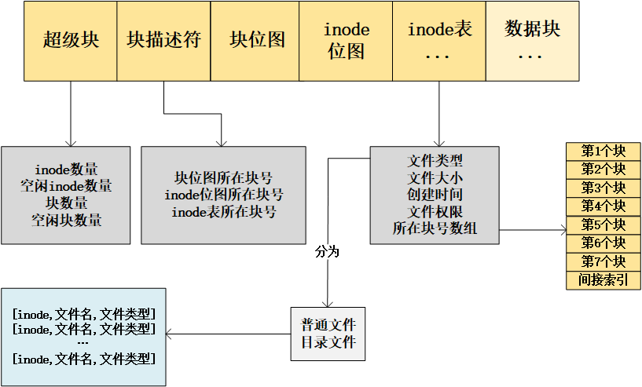

# 第30回 番外篇：你管这破玩意叫文件系统

**案例：** 如果手上有一块硬盘，大小只有1MB，准备把文件存储在硬盘上，要如何设计才能更方便地在硬盘中读写这些文件？

**设计方案：**
- 基本操作（分块）：将硬盘按逻辑分成一个个块，每个块定义为两个物理扇区大小（1KB），这块硬盘有1024个块。
- 解决记录问题（位图）：建立一个位图，每一位表示其中一个块的使用情况，0表示未使用，1表示已使用，块位图放于第0号块中。
- 解决文件查找问题（inode）：建立一个固定大小（128B）的空间用于存储文件大小、文件创建时间、文件权限等信息。
  - `inode`位图用于管理`inode`的使用情况，放于第1号块中
  - 后续块存放`inode`表，主要存放`inode`内容，一个块可以存放8个`inode`，组成一个`inode`表。
- 解决文件存储留下的空洞问题（间接索引）：使用间接索引扩大`inode`记录块号的信息，使得一个`inode`可以记录多个块号。
- 解决块和`inode`的额外信息（超级块和块描述符）：
  - 超级块：用于存储`inode`数量、空闲`inode`数量、块数量、空闲块数量。
  - 块描述符：用于存储块位图、`inode`位图、`inode`表所在的块号信息。
- 解决文件分类问题：使用一个目录类型的`inode`指向的数据块记录文件的`inode`信息。
- 解决目录下的所有文件名和文件类型展示：将一个目录类型的`inode`指向的数据块中的记录文件的`inode`，同时记录文件名和文件类型，删除`inode`表中的文件名和文件类型的内容。
- 解决所有文件的根目录问题：规定`inode`表中的0号`inode`表示根目录。

Ext2文件系统：
- 超级块前面是启动块，由PC联盟给硬盘规定的1KB专属空间，任何文件系统都不能用它。
- `inode`表中用15个块来定位文件，其中第13~15个块分别表示一级、二级、三级间接索引。
- 文件类型很多，常见的例如块设备文件、字符设备文件、管道文件、socket文件等。
- 超级块、块描述符、`inode`表中记录的信息更多。
- 2号`inode`表为根目录。