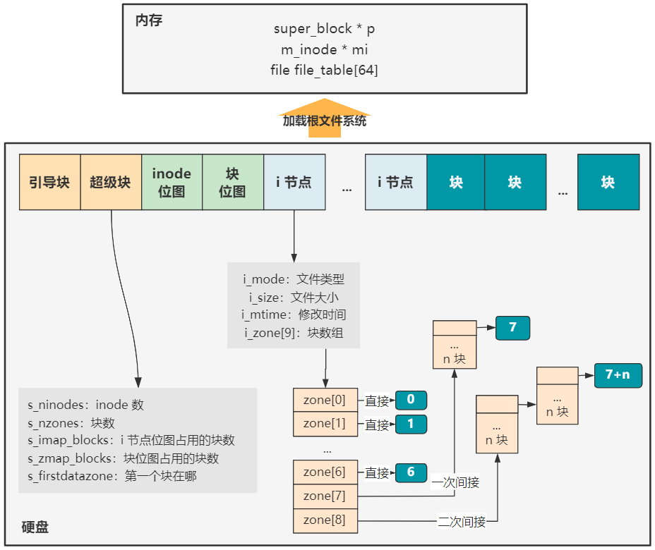

# 第32回 加载根文件系统

## 32.1 硬盘中的文件系统格式

- 引导块启动区：默认存在的块。
- 超级块：用于描述整个文件系统的整体信息。
- `inode`位图和块位图：表示`inode`和块的使用情况。
- `inode`：存放每个文件或目录的元信息和索引信息。
  - 元信息存放文件类型、文件大小、修改时间等。
  - 索引信息：大小为9的`i_zone[9]`数组，表示这个文件或目录的具体数据占用了哪些块。其中0\~6表示直接索引，7表示一次间接索引，8表示二次间接索引。
- 块：用于存放具体文件或目录实际信息的块。

## 32.2 文件结构

```c
// include/linux/fs.h
struct file {
    // 文件类型
    unsigned short f_mode;
    unsigned short f_flags;
    // 被引用的次数
    unsigned short f_count;
    // 文件inode索引信息
    struct m_inode * f_inode;
    off_t f_pos;
};
```

## 32.3 代码解读

```c
// fs/super.c
void mount_root(void) {
    ...
    // 设置文件描述符的引用次数为0
    for(i=0;i<NR_FILE;i++)
        file_table[i].f_count=0;
    ...
    // 对super_block数组初始化
    for(p = &super_block[0] ; p < &super_block[NR_SUPER] ; p++) {
        p->s_dev = 0;
        p->s_lock = 0;
        p->s_wait = NULL;
    }
    // 将硬盘的超级块信息读入内存
    if (!(p=read_super(ROOT_DEV)))
        panic("Unable to mount root");
    // 读取根inode信息
    if (!(mi=iget(ROOT_DEV,ROOT_INO)))
        panic("Unable to read root i-node");
    mi->i_count += 3 ;	/* NOTE! it is logically used 4 times, not 1 */
    p->s_isup = p->s_imount = mi;
    // 将该inode设置为当前进程（进程1）的当前工作目录和根目录
    current->pwd = mi;
    current->root = mi;
    free=0;
    // 记录块位图信息
    i=p->s_nzones;
    while (-- i >= 0)
        if (!set_bit(i&8191,p->s_zmap[i>>13]->b_data))
            free++;
    printk("%d/%d free blocks\n\r",free,p->s_nzones);
    free=0;
    // 记录位图信息
    i=p->s_ninodes+1;
    while (-- i >= 0)
        if (!set_bit(i&8191,p->s_imap[i>>13]->b_data))
            free++;
    printk("%d/%d free inodes\n\r",free,p->s_ninodes);
}
```



- 一开始没有文件被引用，对64个`file_table`里的`f_count`清零。
- 对`super_block`超级块数组初始化。
- 将硬盘的超级块信息读入内存。
- 读取根inode信息。
- 将该inode设置为当前进程（进程1）的当前工作目录和根目录。
- 记录块位图信息。
- 记录位图信息。

**总结：** 把硬盘中的文件系统各种信息搬到内存中。
