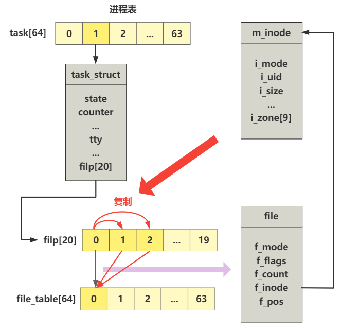

# 第33回 打开终端设备文件

```c
// init/main.c
void init(void) {
    int pid,i;
    
    setup((void *) &drive_info);
    (void) open("/dev/tty0",O_RDWR,0);
    (void) dup(0);
    (void) dup(0);
    ...
}
```

## 33.1 `sys_open`函数解读

```c
int sys_open(const char * filename,int flag,int mode)
{
    struct m_inode * inode;
    struct file * f;
    int i,fd;
    
    mode &= 0777 & ~current->umask;
    // 在进程文件描述符数组filp中找到一个空闲项
    for(fd=0 ; fd<NR_OPEN ; fd++)
        if (!current->filp[fd])
            break;
    if (fd>=NR_OPEN)
        return -EINVAL;
    current->close_on_exec &= ~(1<<fd);
    
    // 在系统文件表file_table中找到一个空闲项
    f=0+file_table;
    for (i=0 ; i<NR_FILE ; i++,f++)
        if (!f->f_count) break;
    if (i>=NR_FILE)
        return -EINVAL;
    
    // 将进程的文件描述符数组项和系统的文件表项对应
    (current->filp[fd]=f)->f_count++;
    // 根据文件名从文件系统中查找inode
    if ((i=open_namei(filename,flag,mode,&inode))<0) {
        current->filp[fd]=NULL;
        f->f_count=0;
        return i;
    }
    /* ttys are somewhat special (ttyxx major==4, tty major==5) */
    if (S_ISCHR(inode->i_mode))
        if (MAJOR(inode->i_zone[0])==4) {
            if (current->leader && current->tty<0) {
                current->tty = MINOR(inode->i_zone[0]);
                tty_table[current->tty].pgrp = current->pgrp;
            }
        } else if (MAJOR(inode->i_zone[0])==5)
            if (current->tty<0) {
                iput(inode);
                current->filp[fd]=NULL;
                f->f_count=0;
                return -EPERM;
            }
    /* Likewise with block-devices: check for floppy_change */
    if (S_ISBLK(inode->i_mode))
        check_disk_change(inode->i_zone[0]);
    
    // 填充file数据
    f->f_mode = inode->i_mode;
    f->f_flags = flag;
    f->f_count = 1;
    f->f_inode = inode;
    f->f_pos = 0;
    return (fd);
}
```

上述代码主要实现了：
1. 在进程文件描述符数组`filp`中找到一个空闲项`fd`。
2. 在系统文件表`file_table`中找到一个空闲项`f`。
3. 将进程的文件描述符数组项和系统的文件表项对应起来。
4. 使用`open_namei`函数，根据文件名从文件系统中查找`inode`。
5. 对文件`f`的各个属性进行赋值，返回文件描述符`fd`，即0。

**注：**
- 进程的`filp`数组大小是20，表示每个进程最多打开20个文件。（按照现代Linux，可通过命令`ulimit -HSn`设置）。
- 系统的`file_table`大小是64，表示整个系统最多打开64个文件。

## 33.2 `sys_dup`函数解读

```c
// fs/fcntl.c
int sys_dup(unsigned int fildes)
{
	return dupfd(fildes,0);
}

// fd表示要复制的文件描述符
// arg表示指定新文件描述符的最小数值
static int dupfd(unsigned int fd, unsigned int arg) {
	if (fd >= NR_OPEN || !current->filp[fd])
		return -EBADF;
	if (arg >= NR_OPEN)
		return -EINVAL;
	while (arg < NR_OPEN)
		if (current->filp[arg])
			arg++;
		else
			break;
	if (arg >= NR_OPEN)
		return -EMFILE;
	current->close_on_exec &= ~(1<<arg);
	(current->filp[arg] = current->filp[fd])->f_count++;
	return arg;
}
```

- 函数主要作用：从进程的`filp`数组中找到下一个空闲项，然后把要复制的文件描述符`fd`的信息，全部复制到这里。
- 原`init`函数中执行了两次`dup`函数，生成1号`fd`和2号`fd`，都指向`tty0`这个外设。
- 通过`open`函数生成了0号`fd`，作为标准输入设备。
- 通过第1个`dup`函数生成了1号`fd`，作为标准输出设备。
- 通过第2个`dup`函数生成了2号`fd`，作为标准错误输出设备。

