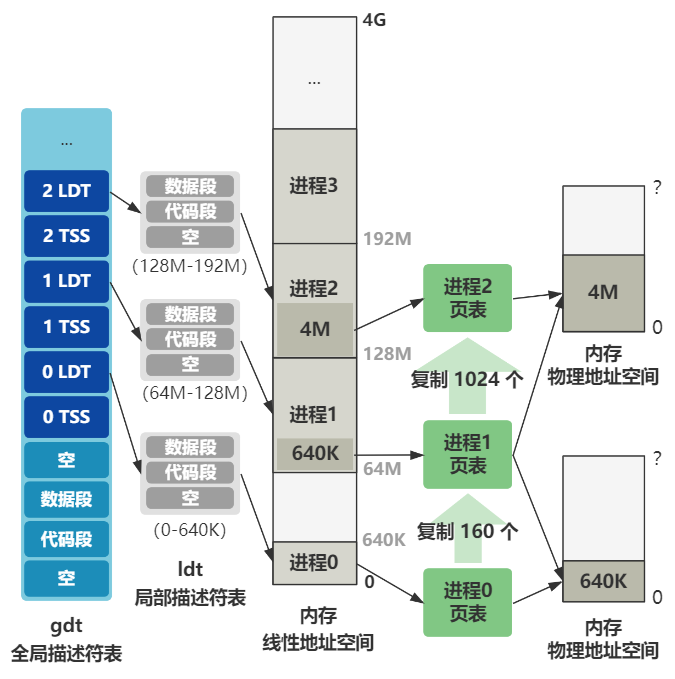

# 第34回 进程2的创建

```c
// init/main.c
void init(void) {
    ...
    if (!(pid=fork())) {
        close(0);
        if (open("/etc/rc",O_RDONLY,0))
            _exit(1);
        execve("/bin/sh",argv_rc,envp_rc);
        _exit(2);
    }
    ...
}
```

主要流程：
1. `fork`一个新的子进程，进程2被创建出来了。
2. 在进程2里关闭0号文件描述符。
3. 以只读形式打开`/etc/rc`文件。
4. 执行`/bin/sh`程序。

## 34.1 `fork`进程2

根据[第27回](../part03/ch27.md)中介绍的写时复制机制，将进程1复制出进程2，与进程0复制出进程1有以下区别：
1. 进程1打开了3个文件描述符并指向`/dev/tty0`，也同样复制到了进程2中，进程结构`task_struct`里的`filp[]`数组被复制了一份。
2. 进程0复制进程1时，页表的复制只有160项（640KB），之后的进程复制是1024项（4MB）



## 34.2 清空0号文件描述符

```c
// fs/open.c
int sys_close(unsigned int fd)
{	
    struct file * filp;
    
    if (fd >= NR_OPEN)
        return -EINVAL;
    current->close_on_exec &= ~(1<<fd);
    if (!(filp = current->filp[fd]))
        return -EINVAL;
    current->filp[fd] = NULL;
    if (filp->f_count == 0)
        panic("Close: file count is 0");
    if (--filp->f_count)
        return (0);
    iput(filp->f_inode);
    return (0);
}
```

将0号文件描述符清空，赋值为`NULL`，即清除从进程1复制过来的标准输入的文件描述符。

## 34.3 打开`/etc/rc`配置文件

```c
// init/main.c
void init(void) {
    ...
    if (!(pid=fork())) {
        close(0);
        if (open("/etc/rc",O_RDONLY,0))
            _exit(1);
        execve("/bin/sh",argv_rc,envp_rc);
        _exit(2);
    }
    ...
}
```

结合[第33回](ch33.md)介绍的，将指向标准输入的0号文件描述符重新指向了`/etc/rc`文件。
