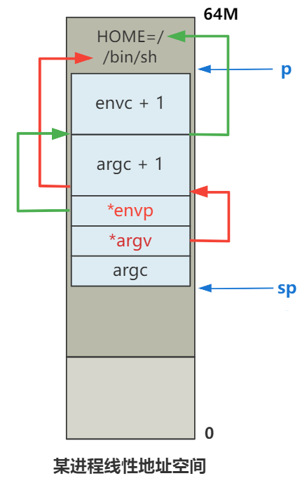

# 第35回 `execve`加载并执行`shell`程序

## 35.1 `execve`调用链

```c
// init/main.c
static char * argv_rc[] = { "/bin/sh", NULL };
static char * envp_rc[] = { "HOME=/", NULL };

// 调用方
execve("/bin/sh",argv_rc,envp_rc);

// lib/execve.c
_syscall3(int,execve,const char *,file,char **,argv,char **,envp)

// kernel/system_call.s
.align 2
_sys_execve:
    lea EIP(%esp),%eax
    pushl %eax
    call _do_execve
    addl $4,%esp
    ret
    
// fs/exec.c
int do_execve(unsigned long * eip,long tmp,char * filename, char ** argv, char ** envp){
    ...
}    
```

其中：
- `eip`：调用方触发系统调用时，由CPU压入栈空间中的`eip`的指针。
- `tmp`：一个无用的占位参数。
- `filename`：`/bin/sh`。
- `argv`：`{"/bin/sh", NULL}`
- `envp`：`{"HOME=/", NULL}`

## 35.2 `do_execve`函数解读

主体代码流程：
1. 检查文件类型和权限等。
2. 将文件的第一块数据读取到缓冲区。
3. 脚本文件与可执行文件的判断。
4. 校验可执行文件是否能执行。
5. 进程管理结构的调整。
6. 释放进程占用的页。
7. 调整线性地址空间、参数列表、堆栈地址等。
8. 设置`eip`和`esp`，完成摇身一变。

### 35.2.1 读取文件开头1KB的数据

```c
// fs/exec.c
int do_execve(...){
    ...
	if (!(inode=namei(filename)))		/* get executables inode */
		return -ENOENT;
	argc = count(argv);
	envc = count(envp);
	...
    
    if (!(bh = bread(inode->i_dev,inode->i_zone[0]))) {
		retval = -EACCES;
		goto exec_error2;
	}
    ...
}
```

- 根据文件名`/bin/sh`获取`inode`。
- 根据`inode`读取文件第一块数据（1024KB）

### 35.2.2 将1KB的数据解析成`exec`结构

```c
// fs/exec.c
int do_execve(...){
    ...
    ex = *((struct exec *) bh->b_data);	/* read exec-header */
    ...
}

// include/a.out.h
struct exec {
    // 魔数
    unsigned long a_magic;	/* Use macros N_MAGIC, etc for access */
    // 代码区长度
    unsigned a_text;		/* length of text, in bytes */
    // 数据区长度
    unsigned a_data;		/* length of data, in bytes */
    // 未初始化数据区长度
    unsigned a_bss;		/* length of uninitialized data area for file, in bytes */
    // 符号表长度
    unsigned a_syms;		/* length of symbol table data in file, in bytes */
    // 执行开始地址
    unsigned a_entry;		/* start address */
    // 代码重定位信息长度
    unsigned a_trsize;		/* length of relocation info for text, in bytes */
    // 数据重定位信息长度
    unsigned a_drsize;		/* length of relocation info for data, in bytes */
};
```

- 在读取文件返回的缓冲头指针中取出数据部分，解析成`exec`结构。
- 该`exec`结构是`a.out`格式文件的头部结构，现代Linux都已经改用ELF格式。

### 35.2.3 判断是脚本文件还是可执行文件

```c
// fs/exec.c
int do_execve(...){
    ...
    if ((bh->b_data[0] == '#') && (bh->b_data[1] == '!') && (!sh_bang)) {
        ...
    }
    brelse(hb);
    ...
}
```

- 通过判断`#!`辨别可执行文件。
- `brelse`函数：释放缓冲块`hb`，由于已经被解析成`exec`结构保存到程序的栈空间中，可以释放这个缓冲块。

### 35.2.4 准备参数空间

```c
// include/a.out.h
#define PAGE_SIZE 4096
// fs/exec.c
#define MAX_ARG_PAGES 32

// fs/exec.c
int do_execve(...){
    ...
    // p = 0x1FFFC = 128k - 4
    unsigned long p=PAGE_SIZE*MAX_ARG_PAGES-4;
    ...
    // p = 0x1FFF5 = 128k - 4 - 7
    p = copy_strings(envc, envp, page, p, 0);
    // p = Ox1FFED = 128k - 4 - 7 - 8
    p = copy_strings(--argc, argv+1, page, p, 0);
    ...
    // p = 0x3FFFFED = 64M - 4 - 7 - 8
    p += change_ldt(ex.a_text,page)-MAX_ARG_PAGES*PAGE_SIZE;
    // p = 0x3FFFFD0
    p = (unsigned long) create_tables((char *)p,argc,envc);
    ...
    // 设置栈指针
    eip[3] = p;
}
```

- 每个进程通过不同的局部描述符在线性地址空间划分出不同的空间，一个进程占64M。
- 参数表大小为128KB，表示每个进程的线性地址空间的末端的128KB为参数表，p指向了参数表的开始处（偏移4B）。
- 加载参数`/HOME=/`和`/bin/sh`，p需要再一次减去7和8。
- 转换到每个进程的线性地址空间视角下的地址偏移（64MB），此时，p = 0x3FFFFED = 64M - 4 - 7 - 8。

### 35.2.5 创建参数表

```c
// fs/exec.c
static unsigned long * create_tables(char * p,int argc,int envc) {
    unsigned long *argv,*envp;
    unsigned long * sp;
    
    sp = (unsigned long *) (0xfffffffc & (unsigned long) p);
    sp -= envc+1;
    envp = sp;
    sp -= argc+1;
    argv = sp;
    put_fs_long((unsigned long)envp,--sp);
    put_fs_long((unsigned long)argv,--sp);
    put_fs_long((unsigned long)argc,--sp);
    while (argc-->0) {
        put_fs_long((unsigned long) p,argv++);
        while (get_fs_byte(p++)) /* nothing */ ;
    }
    put_fs_long(0,argv);
    while (envc-->0) {
        put_fs_long((unsigned long) p,envp++);
        while (get_fs_byte(p++)) /* nothing */ ;
    }
    put_fs_long(0,envp);
    return sp;
}
```

创建如下的参数表，然后将`sp`返回给`p`，用于作为新的栈顶指针，给即将完成替换的`/bin/sh`程序。



### 35.2.6 设置`eip`和`esp`，完成摇身一变

```c
// fs/exec.c
int do_execve(...){
    ...
    eip[0] = ex.a_entry;		/* eip, magic happens :-) */
    eip[3] = p;			/* stack pointer */
    ...
}
```

- 代码指针`eip`决定了CPU将执行哪一段指令。栈指针`esp`决定了CPU压栈操作的位置，以及读取栈空间数据的位置。类似于局部变量`LocalVars`和函数调用链的栈帧`StackFrame`。
- `eip[0]=ex.a_entry`：表示重新设置代码指针`eip`的值，指向`/bin/sh`这个`a.out`格式文件的头结构中的`a_entry`，即程序的入口地址。
- `eip[3] = p`：表示重新设置栈指针`esp`，作为新的栈顶。
- 当中断恢复后，代码会跳转到新的程序中，相当于欺骗了CPU，能顺利跳转到要执行的程序上。