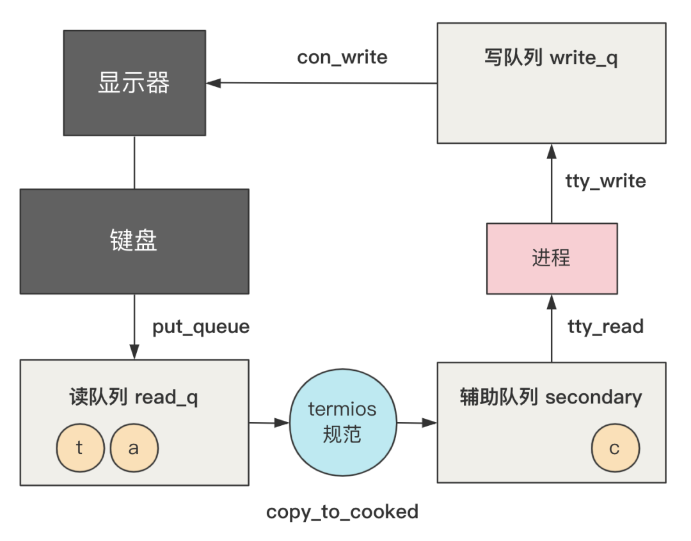

# 第42回 用键盘输入一条命令

## 42.1 场景描述与键盘输入的显示原理

**场景：**

新建一个`info.txt`文件，文件内容如下：

```text
name:flash
age:28
language:java
```

再通过执行以下命令得到结果为3：

```shell
cat info.txt | wc -l
```

**键盘输入的显示原理：**

```nasm
// kernel/chr_drv/keyboard.S
_keyboard_interrupt:
    ...
    
    inb $0x60,%al ;读取键盘扫描码
    ... 
    call key_table(,%eax,4) ;调用对应按键的处理函数
    ...
    pushl $0 ; 0作为参数，调用do_tty_interrupt函数
    call _do_tty_interrupt
    ...
```

1. 通过IO端口操作，从键盘读取刚刚产生的键盘扫描码。
2. 在`key_table`中寻找不同按键对应的不同处理函数，例如普通的一个字母对应的字符处理函数是`do_self`，该函数会将扫描码转换为ASCII码，并放入队列中。
3. 传入参数0，调用`do_tty_interrupt`处理终端的中断处理函数。

## 42.2 终端设备表`tty_table`

```c
// kernel/chr_drv/tty_io.c
void do_tty_interrupt(int tty)
{
    copy_to_cooked(tty_table+tty);
}

struct tty_struct tty_table[] = {
    {
        {...},
        0,			/* initial pgrp */
        0,			/* initial stopped */
        con_write,
        {0,0,0,0,""},		/* console read-queue */
        {0,0,0,0,""},		/* console write-queue */
        {0,0,0,0,""}		/* console secondary queue */
    },
    {...},
    {...}
};
```

上述代码：
- `tty_table`表示终端设备表，主要定义了控制台、串行终端1、串行终端2。
- `do_tty_interrupt`调用了终端设备表的控制台终端。
- `tty_table`每一项的结构是`tty_struct`。

```c
// include/linux/tty.h
struct tty_struct {
	struct termios termios; 
	int pgrp;
	int stopped;
	void (*write)(struct tty_struct * tty);
	struct tty_queue read_q;
	struct tty_queue write_q;
	struct tty_queue secondary;
};

struct tty_queue {
    unsigned long data;
    unsigned long head;
    unsigned long tail;
    struct task_struct * proc_list;
    char buf[TTY_BUF_SIZE];
};
```

其中：
- `termios`定义了终端的各种模式，包括读模式、写模式、控制模式等。
- `void (*write)(struct tty_struct * tty)`：接口函数，当调用0号终端的写操作时，将调用`con_write`函数。
- `read_q`：读队列。
- `write_q`：写队列。
- `secondary`：辅助队列。

## 42.3 将键盘扫描码放入队列

```nasm
// kernel/chr_drv/keyboard.S
key_table:
	.long none,do_self,do_self,do_self	/* 00-03 s0 esc 1 2 */
	.long do_self,do_self,do_self,do_self	/* 04-07 3 4 5 6 */
	.long do_self,do_self,do_self,do_self	/* 08-0B 7 8 9 0 */
	.long do_self,do_self,do_self,do_self	/* 0C-0F + ' bs tab */
	.long do_self,do_self,do_self,do_self	/* 10-13 q w e r */
	.long do_self,do_self,do_self,do_self	/* 14-17 t y u i */
	.long do_self,do_self,do_self,do_self	/* 18-1B o p } ^ */
	.long do_self,ctrl,do_self,do_self	/* 1C-1F enter ctrl a s */
	.long do_self,do_self,do_self,do_self	/* 20-23 d f g h */
	.long do_self,do_self,do_self,do_self	/* 24-27 j k l | */
	.long do_self,do_self,lshift,do_self	/* 28-2B { para lshift , */
	.long do_self,do_self,do_self,do_self	/* 2C-2F z x c v */
	.long do_self,do_self,do_self,do_self	/* 30-33 b n m , */
	...
```

当键盘输入字符`c`，则执行对应的`do_self`函数。

```nasm
// kernel/chr_drv/keyboard.S
do_self:
    ...
    lea key_map,%ebx ;扫描码转换为ASCII码
    ...
    call put_queue ; 放入队列

put_queue:
    pushl %ecx
    pushl %edx
    movl _table_list,%edx		# read-queue for console
    movl head(%edx),%ecx
    ...
    ret
```

```c
// kernel/chr_drv/tty_io.c
struct tty_queue * table_list[]={
    &tty_table[0].read_q, &tty_table[0].write_q,
    &tty_table[1].read_q, &tty_table[1].write_q,
    &tty_table[2].read_q, &tty_table[2].write_q
};
```

具体流程：
1. 在`key_table`中找到对应按键的处理函数，执行`do_self`函数。
2. 将扫描码转换为ASCII码，并调用`put_queue`函数，放入队列中。
3. 将按键的ASCII码写入到`tty_table[0]`的`read_q`队列中。

## 42.4 读队列

```c
// kernel/chr_drv/tty_io.c
void copy_to_cooked(struct tty_struct * tty) {
	signed char c;

	while (!EMPTY(tty->read_q) && !FULL(tty->secondary)) {
	    // 从read_q中取出字符
		GETCH(tty->read_q,c);
        
        // 规则处理
        if (I_UCLC(tty))
            c=tolower(c);
        ...
        
        // 将处理后的字符放入secondary
		PUTCH(c,tty->secondary);
	}
	wake_up(&tty->secondary.proc_list);
}
```

代码解读：
- 该函数有一个循环，只要读队列`read_q`不为空，并且辅助队列`secondary`未满，则不断从`read_q`取出字符，经过规则处理后，写入`secondary`队列中。
- 规则处理：以`I_UCLC`处理为例，判断`termios`中`c_iflag`的第4位是否为1，对字符`c`进行小写转换。
- 终端模式定义如下：

```c
// include/termios.h
struct termio {
	unsigned short c_iflag;		/* input mode flags */
	unsigned short c_oflag;		/* output mode flags */
	unsigned short c_cflag;		/* control mode flags */
	unsigned short c_lflag;		/* local mode flags */
	unsigned char c_line;		/* line discipline */
	unsigned char c_cc[NCC];	/* control characters */
};
```

## 42.5 写队列

```c
// kernel/chr_drv/tty_io.c
int tty_read(unsigned channel, char * buf, int nr) {
    ...
    while (nr>0) {
        do {
            GETCH(tty->secondary,c);
            ...
        } while (nr>0 && !EMPTY(tty->secondary));
        ...
    }
    return (b-buf);
}

int tty_write(unsigned channel, char * buf, int nr) {
    ...
    while (nr>0) {
        while (nr>0 && !FULL(tty->write_q)) {
            if (O_POST(tty)) {
                if (c=='\n' && !cr_flag && O_NLCR(tty)) {
                    cr_flag = 1;
                    PUTCH(13,tty->write_q);
                    continue;
                }
            }
            ...
            PUTCH(c,tty->write_q);
        }
        tty->write(tty);
        if (nr>0)
            schedule();
    }
    return (b-buf);
}
```

代码解读：
- 调用`tty_read`函数，将字符从辅助队列`secondary`中取走。
- 调用`tty_write`函数，将字符放入`write_q`队列中，然后调用`tty`的`write`接口函数，即调用`con_write`函数。
- 执行`con_write`函数，将键盘输入的字符打印到屏幕上。

## 42.6 整体流程



1. 用户从键盘按下按键后，进入键盘中断处理程序`keyboard_interrupt`，最终通过`put_queue`将字符放入`read_q`队列。
2. 通过`copy_to_cooked`函数，经过`termios`规则处理，将处理过的字符放入`secondary`（`read_q`队列里的未处理字符）。
3. 进程通过`tty_read`从`secondary`里读字符，通过`tty_write`将字符写入`write_q`中，再通过`con_write`控制台写函数，将字符打印到显示器上。