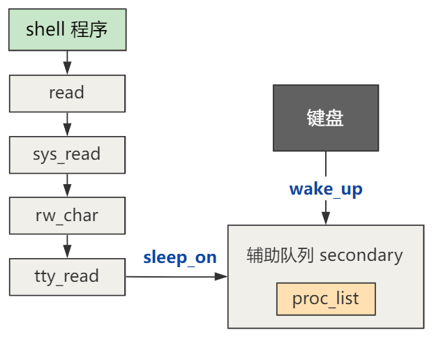

# 第43回 shell程序读取你的命令

shell程序读取字符的操作原理：
1. `shell`程序会通过`getcmd`函数，最终调用`read`函数读入一个个字符，直到读到换行符才返回。
2. 读入的字符在`buf`里，遇到换行符后，这些字符将作为一个完整的命令，传入`runcmd`函数，真正执行这个命令。



## 43.1 `sys_read`读操作函数

```c
// fs/read_write.c
// fd=0, count=1
int sys_read(unsigned int fd,char * buf,int count)
{
    struct file * file;
    struct m_inode * inode;
    
    if (fd>=NR_OPEN || count<0 || !(file=current->filp[fd]))
        return -EINVAL;
    if (!count)
        return 0;
    // 校验buf区域的内存限制
    verify_area(buf,count);
    inode = file->f_inode;
    // 管道文件
    if (inode->i_pipe)
        return (file->f_mode&1)?read_pipe(inode,buf,count):-EIO;
    // 字符设备文件
    if (S_ISCHR(inode->i_mode))
        return rw_char(READ,inode->i_zone[0],buf,count,&file->f_pos);
    // 块设备文件
    if (S_ISBLK(inode->i_mode))
        return block_read(inode->i_zone[0],&file->f_pos,buf,count);
    // 目录文件或普通文件
    if (S_ISDIR(inode->i_mode) || S_ISREG(inode->i_mode)) {
        if (count+file->f_pos > inode->i_size)
            count = inode->i_size - file->f_pos;
        if (count<=0)
            return 0;
        return file_read(inode,file,buf,count);
    }
    // 如果不是以上文件，则提示错误
    printk("(Read)inode->i_mode=%06o\n\r",inode->i_mode);
    return -EINVAL;
}
```

主要是将读取管道文件、字符设备文件、块设备文件、目录文件或普通文件放在一个函数中进行处理，这个函数作为所有读操作的统一入口。

## 43.2 `rw_char`字符读写函数

```c
// include/linux/fs.h
#define MAJOR(a) (((unsigned)(a))>>8)
#define MINOR(a) ((a)&0xff)

// fs/char_dev.c
static crw_ptr crw_table[]={
    NULL,		/* nodev */
    rw_memory,	/* /dev/mem etc */
    NULL,		/* /dev/fd */
    NULL,		/* /dev/hd */
    rw_ttyx,	/* /dev/ttyx */
    rw_tty,		/* /dev/tty */
    NULL,		/* /dev/lp */
    NULL};		/* unnamed pipes */

int rw_char(int rw,int dev, char * buf, int count, off_t * pos)
{
    crw_ptr call_addr;
    
    if (MAJOR(dev)>=NRDEVS)
        return -ENODEV;
    if (!(call_addr=crw_table[MAJOR(dev)]))
        return -ENODEV;
    return call_addr(rw,MINOR(dev),buf,count,pos);
}
```

根据`dev`参数，可以计算出主设备号为4，次设备号为0，根据`crw_table`得到对应的`rw_ttyx`函数，并继续执行该函数。

```c
// fs/char_dev.c
static int rw_ttyx(int rw,unsigned minor,char * buf,int count,off_t * pos)
{
	return ((rw==READ)?tty_read(minor,buf,count):
		tty_write(minor,buf,count));
}
```

该函数入参`rw=READ`，则执行`tty_read`函数。

## 43.3 `tty_read`终端设备读函数

```c
// kernel/chr_drv/tty_io.c
int tty_read(unsigned channel, char * buf, int nr) {
	struct tty_struct * tty;
	char c, * b=buf;
	...
	while (nr>0) {
		...
		if (EMPTY(tty->secondary) || (L_CANON(tty) &&
		!tty->secondary.data && LEFT(tty->secondary)>20)) {
			sleep_if_empty(&tty->secondary);
			continue;
		}
		do {
			GETCH(tty->secondary,c);
			...
            put_fs_byte(c,b++);
            if (!--nr)
                break;
		} while (nr>0 && !EMPTY(tty->secondary));
		...
	}
    ...
	return (b-buf);
}
```

代码解读：
- 函数入参：
  - `channel`为0，表示`tty_table`里的控制台终端设备。
  - `buf`表示读取的数据复制到内存的位置指针，即用户缓冲区指针。
  - `nr`为1，表示读取1个字符。
- 函数功能：不断从`secondary`队列中读取字符，放入`buf`指向的内存中。

```c
// include/linux/tty.h
#define EMPTY(a) ((a).head == (a).tail)
#define GETCH(queue,c) \
(void)({c=(queue).buf[(queue).tail];INC((queue).tail);})
#define PUTCH(c,queue) \
(void)({(queue).buf[(queue).head]=(c);INC((queue).head);})
```

## 43.4 `wake_up`进程唤醒函数

```c
// kernel/sched.c
void wake_up(struct task_struct **p)
{
	if (p && *p) {
		(**p).state=0;
		*p=NULL;
	}
}
```

在不满足读取条件时，使得进程阻塞，但当再次按下键盘按键，使得`secondary`队列中有字符时，修改进程状态为运行状态（`TASK_RUNNING`），唤醒进程。