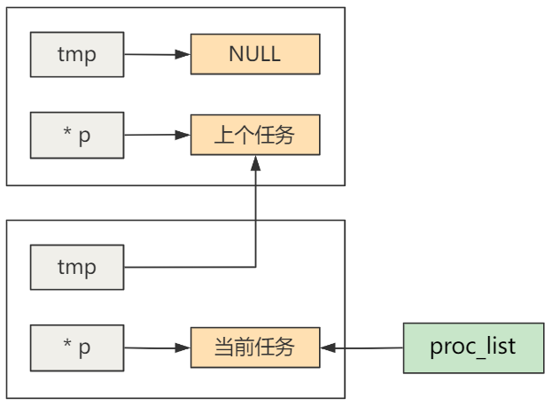

# 第44回 进程的阻塞与唤醒

## 44.1 Linux中进程的5种状态

```c
// include/linux/sched.h
#define TASK_RUNNING		0  // 运行态
#define TASK_INTERRUPTIBLE	1  // 可中断等待状态
#define TASK_UNINTERRUPTIBLE	2 // 不可中断等待状态
#define TASK_ZOMBIE		3 // 僵死状态
#define TASK_STOPPED		4 // 停止
```

- 当进程首次被创建时，它的初始状态为0，即运行态。
- 只有处于运行态的进程，才会被调度机制选中，详见[第24回](../part03/ch24.md)
- 如果要使得一个进程阻塞，只需将其`state`变成非`TASK_RUNNING`即可，让它暂时不被CPU调度。

## 44.2 进程阻塞

```c
// kernel/sched.c
void sleep_on(struct task_struct **p) {
    struct task_struct *tmp;
    
    if (!p)
        return;
    if (current == &(init_task.task))
        panic("task[0] trying to sleep");
    tmp = *p;
    *p = current;
    // 将进程的state变成不可中断等待状态
    current->state = TASK_UNINTERRUPTIBLE;
    schedule();
    if (tmp)
        tmp->state=0;
}
```

## 44.3 进程唤醒

```c
// kernel/sched.c
void wake_up(struct task_struct **p) {
    if (p && *p) {
        // 将进程的state变成可运行态
        (**p).state=0;
        *p=NULL;
    }
}
```

## 44.4 进程链`proc_list`

```c
// kernel/sched.c
void interruptible_sleep_on(struct task_struct **p)
{
	struct task_struct *tmp;

	if (!p)
		return;
	if (current == &(init_task.task))
		panic("task[0] trying to sleep");
	tmp=*p;
	*p=current;
repeat:	current->state = TASK_INTERRUPTIBLE;
	schedule();
	if (*p && *p != current) {
		(**p).state=0;
		goto repeat;
	}
	*p=NULL;
	if (tmp)
		tmp->state=0;
}
```

进程链中的进程阻塞：
- 首次调用`sleep_on`函数，此时传入的`*p`为`NULL`，还没有等待`secondary`这个队列的进程。使得`proc_list`指向当前进程的`task_struct`。
- 当有另一个进程调用`tty_read`读取了同一个`tty`的数据时，需要再次调用`sleep_on`，这时`*p`就指向了之前进程的`task_struct`。
- 通过每个当前进程的`tmp`变量，总能找到上一个正在同样等待一个资源的进程，形成一个进程链。



进程链中的进程唤醒：
- 当某个进程调用了`wake_up`函数，唤醒了进程链上指向的第一个进程，该进程会在`sleep_on`函数执行完`schedule`后被唤醒，并执行之后的代码。
- 同时将`tmp`指针指向上一个进程，该进程也同样被唤醒。
