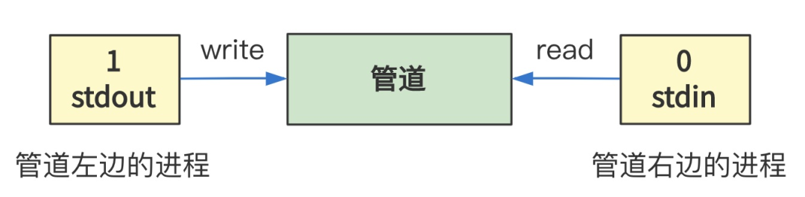

# 第45回 解析并执行shell命令

## 45.1 xv6操作系统中的`shell`

```c
// xv6-public sh.c简化代码
int main(void) {
  static char buf[100];

  // 读取命令
  while(getcmd(buf, sizeof(buf)) >= 0){
    // 创建新进程
    if(fork() == 0)
        // 执行命令
        runcmd(parsecmd(buf));
    // 等待进程退出    
    wait();
  }
}

void runcmd(struct cmd *cmd) {
    ...
    switch(cmd->type){
        default:
            panic("runcmd");

        case EXEC:
            ecmd = (struct execcmd*)cmd;
            ...
            exec(ecmd->argv[0], ecmd->argv);
            printf(2, "exec %s failed\n", ecmd->argv[0]);
            break;
        case REDIR: ...
        case LIST: ...
        case PIPE: ...
        case BACK: ...
    }
}
```

- 根据`cmd`的`type`字段，判断需要执行命令的操作，比如直接执行`EXEC`。
- 如果命令中有分号`;`，说明是多条命令的组合，当作`LIST`拆分成多条命令依次执行。
- 如果命令中有竖线`|`，说明是管道命令，当作`PIPE`拆分成两条并发的命令，同时通过管道串联输入端和输出端来执行。

## 45.2 管道的创建

```c
void runcmd(struct cmd *cmd) {
    ...
    switch(cmd->type){
        ...
        case PIPE:
            pcmd = (struct pipecmd*)cmd;
            if(pipe(p) < 0)
                panic("pipe");
            // 建立管道左边
            if(fork() == 0) {
                close(1);
                dup(p[1]);
                close(p[0]);
                close(p[1]);
                // 执行管道左边的程序
                runcmd(pcmd->left);
            }
            // 建立管道右边
            if(fork() == 0) {
                close(0);
                dup(p[0]);
                close(p[0]);
                close(p[1]);
                // 执行管道右边的程序
                runcmd(pcmd->right);
            }
            close(p[0]);
            close(p[1]);
            wait();
            wait();
            break;
    }
}    
```

- 管道的本质是一个文件，属于管道类型的文件，其中一个进程只能读，另一个进程只能写。
- 数组的`p[0]`指向管道的读口，`p[1]`指向管道的写口。
- 建立管道左边：左边进程关闭1号标准输出文件描述符，复制`p[1]`并填充在1号文件描述符上，然后把`p[0]`和`p[1]`关闭，即1号文件描述符指向`p[1]`管道的写口。
- 建立管道右边：右边进程的0号文件描述符指向`p[0]`管道的读口。
- 父进程关闭`p[0]`和`p[1]`两个子进程，由于父进程执行的`pipe`仅仅是为了两个子进程申请文件描述符，并不需要这两个进程。



函数的主要功能是创建了两个进程，左边的进程的标准输出指向管道的写口，右边的进程的标准输入指向管道的读口。

## 45.3 创建管道子进程`sys_pipe`函数

```c
int sys_pipe(unsigned long * fildes)
{
    struct m_inode * inode;
    struct file * f[2];
    int fd[2];
    int i,j;
    
    // 在文件系统表中找到空闲项
    j=0;
    for(i=0;j<2 && i<NR_FILE;i++)
        if (!file_table[i].f_count)
            (f[j++]=i+file_table)->f_count++;
    if (j==1)
        f[0]->f_count=0;
    if (j<2)
        return -1;
    // 在文件描述符表filp数组中找到空闲项
    j=0;
    for(i=0;j<2 && i<NR_OPEN;i++)
        if (!current->filp[i]) {
            current->filp[ fd[j]=i ] = f[j];
            j++;
        }
    if (j==1)
        current->filp[fd[0]]=NULL;
    if (j<2) {
        f[0]->f_count=f[1]->f_count=0;
        return -1;
    }
    
    // 根据文件名找到inode信息
    if (!(inode=get_pipe_inode())) {
        current->filp[fd[0]] =
            current->filp[fd[1]] = NULL;
        f[0]->f_count = f[1]->f_count = 0;
        return -1;
    }
    // 填充两个文件描述符
    f[0]->f_inode = f[1]->f_inode = inode;
    f[0]->f_pos = f[1]->f_pos = 0;
    // 读模式
    f[0]->f_mode = 1;		/* read */
    // 写模式
    f[1]->f_mode = 2;		/* write */
    put_fs_long(fd[0],0+fildes);
    put_fs_long(fd[1],1+fildes);
    return 0;
}
```

基本上和打开文件的原理类似，唯一不同的是文件已经存在。

```c
// include/linux/fs.h
#define PIPE_HEAD(inode) ((inode).i_zone[0])
#define PIPE_TAIL(inode) ((inode).i_zone[1])

// fs/inode.c
struct m_inode * get_pipe_inode(void)
{
	struct m_inode * inode;

	if (!(inode = get_empty_inode()))
		return NULL;
	if (!(inode->i_size=get_free_page())) {
		inode->i_count = 0;
		return NULL;
	}
	inode->i_count = 2;	/* sum of readers/writers */
	PIPE_HEAD(*inode) = PIPE_TAIL(*inode) = 0;
	inode->i_pipe = 1;
	return inode;
}
```

创建管道的`inode`，该管道类型文件的`i_size`表示管道使用的页内存的起始地址。
