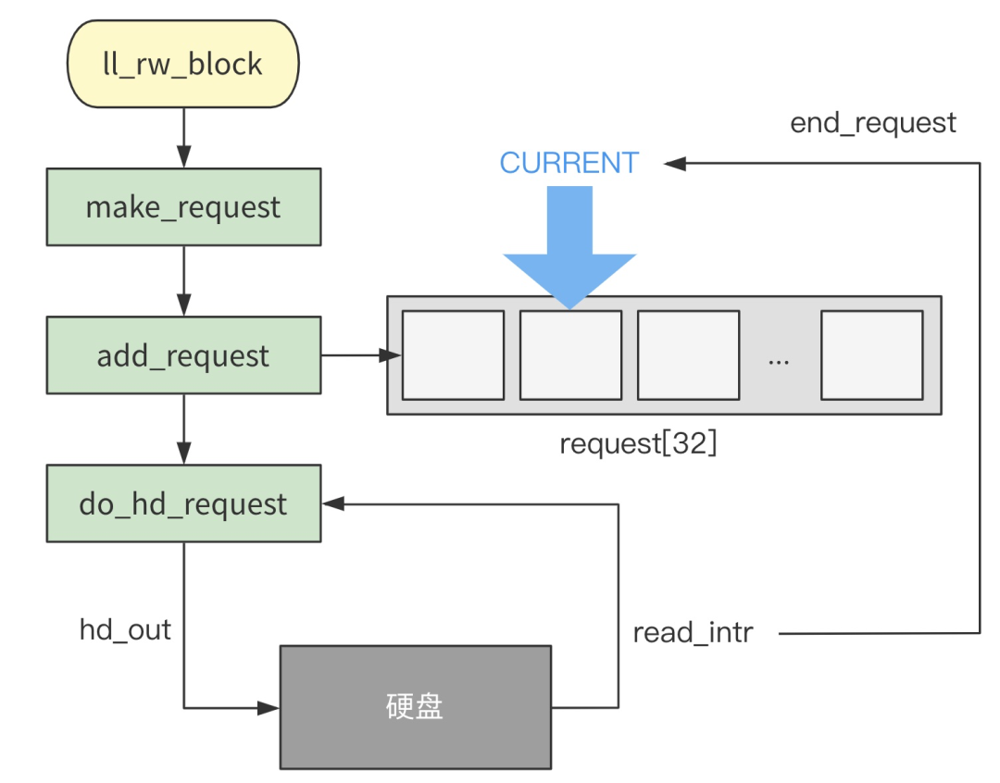

# 第47回 读取硬盘数据的细节

```c
// kernel/blk_drv/ll_rw_blk.c
void ll_rw_block(int rw, struct buffer_head * bh) {
	unsigned int major;

	if ((major=MAJOR(bh->b_dev)) >= NR_BLK_DEV ||
	!(blk_dev[major].request_fn)) {
		printk("Trying to read nonexistent block-device\n\r");
		return;
	}
	make_request(major,rw,bh);
}

struct request request[NR_REQUEST] = {0};

static void make_request(int major,int rw, struct buffer_head * bh) {
    struct request * req;
    ...
    // 从request队列找到一个空位
    if (rw == READ)
        req = request+NR_REQUEST;
    else
        req = request+((NR_REQUEST*2)/3);
    while (--req >= request)
        if (req->dev<0)
            break;

    // 构造request结构
    req->dev = bh->b_dev;
    req->cmd = rw;
    req->errors=0;
    req->sector = bh->b_blocknr<<1;
    req->nr_sectors = 2;
    req->buffer = bh->b_data;
    req->waiting = NULL;
    req->bh = bh;
    req->next = NULL;
    add_request(major+blk_dev,req);
}
```

## 47.1 `add_request`插入请求函数

```c
// kernel/blk_drv/ll_rw_blk.c
static void add_request(struct blk_dev_struct * dev, struct request * req) {
	struct request * tmp;

	req->next = NULL;
	cli();
    // 清除dirt位
	if (req->bh)
		req->bh->b_dirt = 0;
    // 当前请求项为空，那么立即执行当前请求项
	if (!(tmp = dev->current_request)) {
		dev->current_request = req;
		sti();
		(dev->request_fn)();
		return;
	}
    // 插入链表中
	for ( ; tmp->next ; tmp=tmp->next)
		if ((IN_ORDER(tmp,req) ||
		    !IN_ORDER(tmp,tmp->next)) &&
		    IN_ORDER(req,tmp->next))
			break;
	req->next=tmp->next;
	tmp->next=req;
	sti();
}
```

代码解读：
1. 从`request`数组中找到一个空位。
2. 将空位作为链表项插入`request`链表中。

## 47.2 当请求项为空时的执行情况

```c
// kernel/blk_drv/ll_rw_blk.c
struct blk_dev_struct blk_dev[NR_BLK_DEV] = {
	{ NULL, NULL },		/* no_dev */
	{ NULL, NULL },		/* dev mem */
	{ NULL, NULL },		/* dev fd */
	{ NULL, NULL },		/* dev hd */
	{ NULL, NULL },		/* dev ttyx */
	{ NULL, NULL },		/* dev tty */
	{ NULL, NULL }		/* dev lp */
};

static void add_request(struct blk_dev_struct * dev, struct request * req) {
    ...
    if (!(tmp = dev->current_request)) {
        ...
        (dev->request_fn)();  
        ...
    }
    ...
}
```

- 当设备的当前请求项为空，即第一次收到硬盘操作请求时，会立刻执行该设备的`request_fn`函数。
- 从`blk_dev`数组中取出`blk_dev[3]`的设备结构，即硬盘的设备结构。

```c
// kernel/blk_drv/blk.h
#elif (MAJOR_NR == 3)
/* harddisk */
#define DEVICE_NAME "harddisk"
#define DEVICE_INTR do_hd
#define DEVICE_REQUEST do_hd_request
#define DEVICE_NR(device) (MINOR(device)/5)
#define DEVICE_ON(device)
#define DEVICE_OFF(device)

// kernel/blk_drv/hd.c
void hd_init(void) {
	blk_dev[MAJOR_NR].request_fn = DEVICE_REQUEST;
	set_intr_gate(0x2E,&hd_interrupt);
	outb_p(inb_p(0x21)&0xfb,0x21);
	outb(inb_p(0xA1)&0xbf,0xA1);
}
```

从上述代码中，可以得到`blk_dev[3].request_fn`是`do_hd_request`函数。

## 47.3 `do_hd_request`函数

```c
// kernel/blk_drv/hd.c
void do_hd_request(void) {
	dev = MINOR(CURRENT->dev);
	block = CURRENT->sector;
	...
    nsect = CURRENT->nr_sectors;
    // 根据当前请求调用hd_out函数，传入不同的参数
	if (CURRENT->cmd == WRITE) {
		hd_out(dev,nsect,sec,head,cyl,WIN_WRITE,&write_intr);
		...
	} else if (CURRENT->cmd == READ) {
		hd_out(dev,nsect,sec,head,cyl,WIN_READ,&read_intr);
	} else
		panic("unknown hd-command");
}

static void hd_out(unsigned int drive,unsigned int nsect,unsigned int sect,
    unsigned int head,unsigned int cyl,unsigned int cmd,
    void (*intr_addr)(void)) {
    ...
    do_hd = intr_addr;
    outb_p(hd_info[drive].ctl,HD_CMD);
    port=HD_DATA;
    outb_p(hd_info[drive].wpcom>>2,++port);
    outb_p(nsect,++port);
    outb_p(sect,++port);
    outb_p(cyl,++port);
    outb_p(cyl>>8,++port);
    outb_p(0xA0|(drive<<4)|head,++port);
    outb(cmd,++port);
}
```

- 根据当前请求调用hd_out函数，传入不同的参数。
- 读硬盘的操作就是想其他端口写数据，告诉系统需要读硬盘的扇区、读取长度等，然后再逐个字节地读取数据。
- 从`0x1F0`端口读出硬盘的操作是在硬盘中断处理函数`hd_interrupt`里执行的。

## 47.4 `hd_interrupt`硬盘中断处理函数

```nasm
// kernel/system_call.s 
_hd_interrupt:
	...
	xchgl _do_hd,%edx
	...
	call *%edx		# "interesting" way of handling intr.
	...
	iret
```

`do_hd`函数被调用进行读操作时，将会指向`read_intr`函数。

```c
// kernel/blk_drv/hd.c
#define port_read(port,buf,nr) \
__asm__("cld;rep;insw"::"d" (port),"D" (buf),"c" (nr):"cx","di")

static void read_intr(void)
{
    ...
    // 从数据端口将数据读到内存
	port_read(HD_DATA,CURRENT->buffer,256);
	CURRENT->errors = 0;
	CURRENT->buffer += 512;
	CURRENT->sector++;
    // 还没有读完，则直接返回等待下次再读
	if (--CURRENT->nr_sectors) {
		do_hd = &read_intr;
		return;
	}
    // 所有扇区都读完了，删除本次请求项
	end_request(1);
    // 再次触发硬盘操作
	do_hd_request();
}
```

代码整体逻辑：
- 调用`port_read`函数，从端口`HD_DATA`中读取256次数据，每次读一个字，一共读取512字节的数据。
- 如果没有读完所要求的字节数，直接返回，等待下次硬盘触发中断。
- 如果已经读完，则调用`end_request`函数将请求项清除。
- 再次调用`do_hd_request`函数。

```c
// kernel/blk_drv/blk.h
extern inline void end_request(int uptodate) {
	DEVICE_OFF(CURRENT->dev);
	if (CURRENT->bh) {
		CURRENT->bh->b_uptodate = uptodate;
		unlock_buffer(CURRENT->bh);
	}
    ...
	wake_up(&CURRENT->waiting);
	wake_up(&wait_for_request);
	CURRENT->dev = -1;
	CURRENT = CURRENT->next;
}
```

- 第1个`wake_up`唤醒该请求项对应的等待进程`waiting`，通知该进程，请求项的读盘操作处理完毕。
- 第2个`wake_up`唤醒，由于`request`队列满了而没有将请求项插进来的进程`wait_for_request`。
- 将当前设备的当前请求项`CURRENT`，即`request`数组中的一个请求项`request`的`dev`置空，并指向链表的下一个请求项，即需要处理的下一个请求项。

## 47.5 整体流程



1. 当设备的当前请求项为空时，`ll_rw_block`会在执行到`add_request`函数时，直接执行`do_hd_request`函数发起读盘请求。如果已经有执行中的请求项时，插入`request`链表。
2. 当`do_hd_request`函数执行完毕后，硬盘发起读或写请求，执行完毕后会发起硬盘中断，调用`read_intr`中断处理函数。
3. `read_intr`会改变当前请求项指针，指向`request`链表的下一个请求项，再次调用`do_hd_request`函数，不断处理`request`链表中的一个个硬盘请求项。